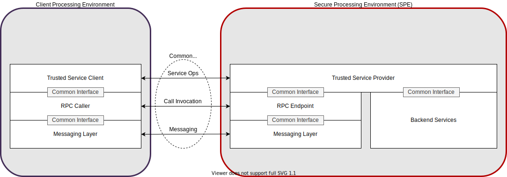
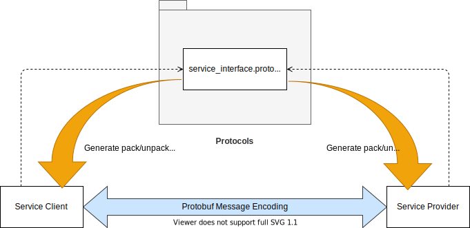

Architecture Overview
=====================

The Trusted Services project provides a framework for developing applications that can be built and deployed in
different secure processing environments and on different hardware platforms.  The structure and conventions adopted
are designed to maximize opportunities for component reuse.  The project adopts a portability model based on the
*ports and adapters* architectural pattern, which promotes loose coupling between an application
and its environment.  The model allows applications to be deployed in a diverse range of environments from full
featured trusted OSs, such as OP-TEE, to bare metal secure partitions.

For a more in-depth description of how the ports and adapters pattern is applied, see:
:ref:`Service Deployment Model`

Service Model
-------------

Trusted services conform to a client/server model where service specific operations are invoked using an RPC mechanism.
The realization of the RPC layer and any underlying messaging layer may vary between deployments but the service layer
should be identical for every deployment of a particular service.  The following diagram illustrates the common layered
model and where standardization on layer interfaces and protocols will be aimed for.

The layered service model is reflected in the project source tree where software components are organized by layer and role.
Because components that perform the same role are inter-changeable, there is much flexibility to meet the needs of
different deployments. For example:

    - An instance of the secure storage service could be accessed by different types of client, each presenting
      different upper edge APIs to suite the needs of different applications.  Some different secure storage clients
      could be:

        - A filesystem driver that presents a filesystem mount for user-space access to stored objects.
        - A client that presents the PSA Protected Storage API.

    - Different types of secure storage provider are possible, each accessed using a common protocol. Some different
      secure storage providers could be:

        - A secure storage provider that uses an external RPMB serial flash device for storage.
        - A secure storage provider that encrypts objects before passing them to a normal world agent to access
          file-backed storage.

    - Different RPC layers may be used to access services deployed in different secure processing environments.

Service Deployments
-------------------

The ability to deploy trusted services over a range of secure processing environments allows a consistent view of
services to be presented to clients, independent of the back-end implementation.  For a particular service deployment, a
concrete set of build-time and run-time dependencies and configurations must be defined.  Representing each deployment
in the project structure allows multiple deployments to be supported, each reusing a subset of shared components.
The following diagram illustrates the dependencies and configurations that must be defined for a fully specified
deployment.

.. uml:: uml/ServiceDeployment.puml

Currently supported deployments are listed here:
:ref:`Deployments`

Service Access Protocols
------------------------

As mentioned in the section on layering, trusted services are accessed by clients via an RPC layer.  Independent of the
mechanics of the RPC layer, a service access protocol is defined by:

   - A supported set of operations, each qualified by an opcode.
   - A set of request and response message parameter definitions, one for each operation.

The main documentation page for service access protocols is here: :ref:`Service Access Protocols`.

The trusted service framework can accommodate the use of arbitrary serializations for message parameters.  So far,
message protocols using Google Protocol Buffers and packed C structures have been defined.

--------------

*Copyright (c) 2020-2022, Arm Limited and Contributors. All rights reserved.*

SPDX-License-Identifier: BSD-3-Clause
