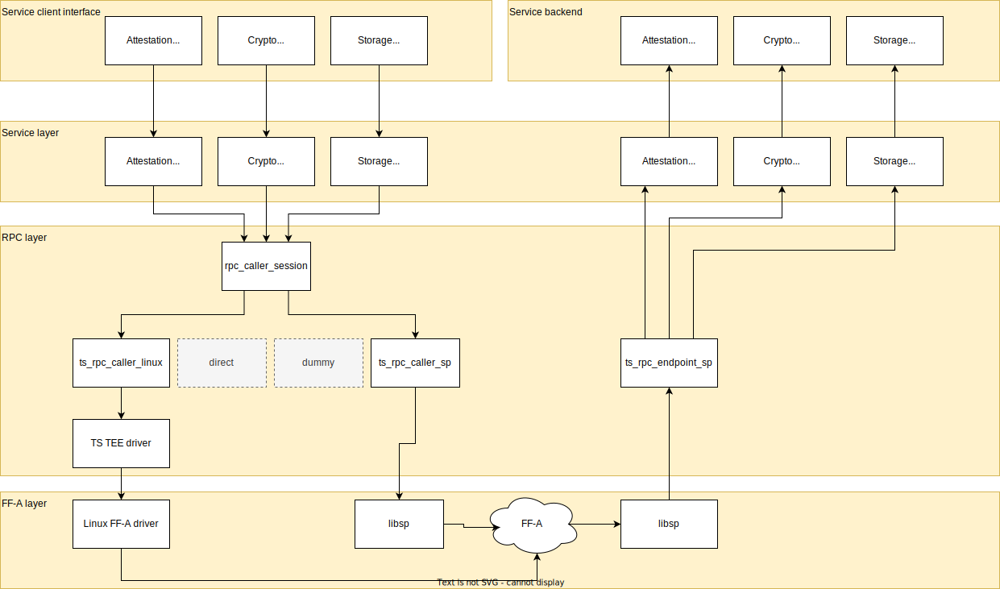
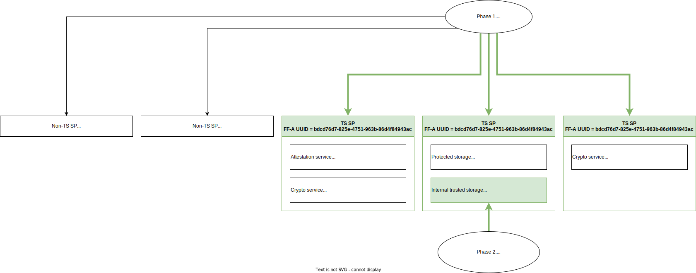

Service Access Protocols
========================

A trusted service is accessed by calling service-specific methods via an RPC mechanism.  The set of callable methods forms the
public interface exposed by a service.  This section is concerned with interface conventions and protocols used for serializing
method parameters and return values. It is anticipated that there will be a need to support different parameter serialization
schemes to suite different needs.  The project accommodates this with the following:

    - The Protocols directory structure allows for different protocol definitions for the same service.
    - Message serialization code is decoupled from service provider code using an abstract 'serializer' interface.  Alternative
      concrete serializers may provide implementations of the interface.

A deployment independent interface for locating services and establishing RPC sessions is described here: :ref:`Service Locator`

Trusted Services protocol layers
--------------------------------



* Service client interface: This component provides the interface to a given service for a user application, i.e. the PSA
  Crypto, Internal Trusted Storage, etc. interface.

* Service layer: This layer is responsible for serializing and deserializing the service specific parameters and it provides
  a transparent interface between the caller and endpoint side.

* RPC layer:

   * RPC caller session: This component provides a session-like object for the service layer. After opening the session, it is
     tied to the opened service interface of the endpoint. Each service call can use the simple begin/invoke/end interface for
     requesting a buffer for the call parameters, for invoking the call and for releasing the response buffer.

     The RPC caller session manages the lifetime of the shared memory. Currently it has two options. It either creates the
     memory on session open and keeps it while the session is open, or it creates the shared buffer for each call and releases
     it when the call ends (``end()``).

   * RPC caller implementations (`ts_rpc_caller_linux`, `ts_rpc_caller_sp`, etc.): The RPC caller session is built on the
     primitives of the RPC callers. These primitives allow the caller session finding the remote endpoint, creating and
     releasing shared memories and doing the actual call.

     The main RPC implementation is the TS RPC which is a TS specific RPC solution over FF-A. The project contains caller
     implementations for Linux and for S-EL0 SPs. The Linux implementation is split between the user space and a kernel driver.

     There are other RPC caller implementations (dummy, direct) which are used for testing purposes.

   * RPC endpoint (`ts_rpc_endpoint_sp`): This component provides the RPC endpoint which can host multiple services. Once it
     receives the call from the client, it finds the matching service and forwards the serialized call parameters to it.

* FF-A layer: It is the transport layer of the protocol stack, and it provides interfaces for sending messages and sharing
  memory between normal world and secure world components.

TS RPC implementation
---------------------

Generic concepts
''''''''''''''''

* The requests are always sent by the caller and the endpoint sends a response.
* The protocol version describes the ABI, the allowed values of the message fields and the behavior of the calls.
* Service endpoints are provided by FF-A secure partitions.
* Each endpoint can implement multiple services. The services are identified by their service UUID (**not** FF-A UUID). To
  avoid including the UUID in each service call, a short interface ID is assigned to each service. The mapping of service
  UUIDs and interface IDs can be queried by an RPC call. The lifetime of the interface ID is the same as the lifetime of the
  service. The `0xff` interface ID is used for the management interface.
* The service calls use shared memory to forward the call payload. It has to be shared via FF-A and then retrieved by the
  endpoint. The shared memories are tied to an endpoint not to a service.
* The errors which happen in the RPC layer will result in a RPC status code which indicates an error.
* The errors which happen in the service handler will result in a service status code which indicates an error. In this case
  the RPC status code will be `RPC_SUCCESS` as the RPC layer was able to forward the call between the service caller and the
  service handler.

ABI
'''

The ABI of the TS RPC protocol uses the 32 bit variants of ``FFA_MSG_SEND_DIRECT_REQ`` and ``FFA_MSG_SEND_DIRECT_RESP``
interfaces of the FF-A specification. The use of the implementation specific arguments is listed in the table below.

.. list-table:: TS RPC ABI
  :header-rows: 1

  * - Message name
    - Short message ID
    - W3[31:30] - SAP
    - W3[29:24] - Flags
    - W3[23:16] - Interface ID
    - W3[15:0] - Opcode
    - W4 - Arg1
    - W5 - Arg2
    - W6 - Arg3
    - W7 - Arg4
  * - RPC protocol version get request
    - ``VERSION_GET``
    - ``0b00``
    - ``0b000000``
    - ``0xff``
    - ``0x0000``
    - Reserved (MBZ)
    - Reserved (MBZ)
    - Reserved (MBZ)
    - Reserved (MBZ)
  * - RPC protocol version get response
    - ``VERSION_GET``
    - ``0b00``
    - ``0b000000``
    - ``0xff``
    - ``0x0000``
    - Version, starting from ``0x00000001``
    - Reserved (MBZ)
    - Reserved (MBZ)
    - Reserved (MBZ)
  * - Memory retrieve request
    - ``MEM_RETRIEVE``
    - ``0b00``
    - ``0b000000``
    - ``0xff``
    - ``0x0001``
    - FF-A memory handle LSW
    - FF-A memory handle MSW
    - FF-A memory tag LSW
    - FF-A memory tag MSW
  * - Memory relinquish request
    - ``MEM_RELINQUISH``
    - ``0b00``
    - ``0b000000``
    - ``0xff``
    - ``0x0002``
    - FF-A memory handle LSW
    - FF-A memory handle MSW
    - Reserved (MBZ)
    - Reserved (MBZ)
  * - Memory retrieve/relinquish response
    - ``MEM_RETRIEVE``/``MEM_RELINQUISH``
    - ``0b00``
    - ``0b000000``
    - ``0xff``
    - ``0x0001``/``0x0002``
    - TS RPC status
    - Reserved (MBZ)
    - Reserved (MBZ)
    - Reserved (MBZ)
  * - Service info get request
    - ``SERVICE_INFO_GET``
    - ``0b00``
    - ``0b000000``
    - ``0xff``
    - ``0x0003``
    - Service UUID
    - Service UUID
    - Service UUID
    - Service UUID
  * - Service info get response
    - ``SERVICE_INFO_GET``
    - ``0b00``
    - ``0b000000``
    - ``0xff``
    - ``0x0003``
    - TS RPC status
    - ``[31:8]`` Reserved

      ``[7:0]`` Queried service interface ID
    - Reserved (MBZ)
    - Reserved (MBZ)
  * - Service call request
    -
    - ``0b00``
    - ``0b000000``
    - Service interface ID
    - Service opcode
    - FF-A memory handle LSW
    - FF-A memory handle MSW
    - Request length
    - Client ID
  * - Service call response
    -
    - ``0b00``
    - ``0b000000``
    - Service interface ID
    - Service opcode
    - TS RPC status
    - Service status
    - Response length
    - Reserved

* **RPC protocol version get**

  Queries the RPC protocol version. This message must be available and backwards compatible for all protocol versions.

* **Memory retrieve**

  Requests the endpoint to do an ``FFA_MEM_RETRIEVE_REQ`` call using the forwarded FF-A memory handle and tag.

* **Memory relinquish**

  Requests the endpoint to do an ``FFA_MEM_RELINQUISH`` call using the forwarded FF-A memory handle.

* **Service info get**

  Query service information from the endpoint by the UUID of the service. The UUID is transmitted as defined in SMCCC section
  5.3 but in registers W4-W7. The returned service interface ID should be used in the service calls. Multiple endpoints can
  implement the same service but one endpoint can implement a service only once.

* **Service call**

  After creating a shared memory and querying the interface ID for a given service UUID the caller can make a service call. The
  service opcode and the contents of the shared memory is service specific. The request and response length fields indicate the
  used area of the shared memory.

  It is allowed to do a limited service call without shared memory, i.e. doorbell call. In this case the FF-A memory ID has to
  be the invalid handle value ``0xffffffffffffffff``.

Service discovery
'''''''''''''''''

* Query all TS SPs via ``FFA_PARTITION_INFO_GET`` call made to the SPMC. All TS SPs have the same FF-A UUID:
  ``bdcd76d7-825e-4751-963b-86d4f84943ac`` If the system setup has fixed SP endpoint IDs, this step can be skipped.
* Iterate thought the TS SPs and make a "Service info get request" RPC call to the SPs, containing the service UUID. If the
  RPC status in the "Service info get response" is `RPC_SUCCESS`, the SP implements the service and its interface ID is returned
  in the response.
* If there are multiple instances of a service, the selection between these should be done in a service specific way (i.e.
  query service version, capabilities, etc.).



RPC status code values
'''''''''''''''''''''''

The status codes for the RPC layer are defined in `components/rpc/common/interface/rpc_status.h`. Currently the following values
are defined:

.. literalinclude:: ../../components/rpc/common/interface/rpc_status.h
    :lines: 20-32
    :language: C

Example TS RPC call
'''''''''''''''''''

This example shows the full sequence of a service call by opening the RPC session, doing the call (begin/invoke/end) and then
closing the session. In this case the RPC session it set to create individual shared memory for each call.

.. uml:: uml/TSRPCCall.puml

.. note::
  Although the TS RPC layer messages use ``FFA_MSG_SEND_DIRECT_REQ``/``FFA_MSG_SEND_DIRECT_RESP`` interface and go through the
  SPMC their destination is not the SPMC but the RPC endpoint. For simplifying the diagram, these calls are showed as direct
  calls between the TS RPC caller and the TS RPC endpoint.

Status Codes
------------

On returning from a request to invoke a service method, two status codes are returned:

  - *RPC status* - A generic status code that corresponds to the RPC call transaction.  RPC status codes are standardized across
    all services. (See: `RPC status code values`_)
  - *Service status* - a service specific status code. (See: `Service Status Codes`_ )

Separation of status codes by layer allows service specific status codes to be accommodated while keeping RPC status codes
common.

A client should only check the returned service status if the returned RPC status value is `RPC_SUCCESS`.  All other RPC
status values indicate that an error occurred in delivering the RPC request.  An RPC status of `RPC_SUCCESS` does not
indicate that the service was successful. It merely indicates that the request was delivered, a suitable handler was
identified and the request parameters were understood.

Service Access Protocol Definition Conventions
----------------------------------------------

A service access protocol defines the following:

  - Opcodes used for identifying service methods.
  - Request parameters for each method.
  - Response parameters for method return values.
  - Operation status code.

Details of how public interface definition files for trusted services are organized, see: :ref:`Project Structure`

It is possible that for certain deployments, it will be necessary to customize which parameter encoding scheme is used.  Many
schemes are possible such as Protocol Buffers, CBOR, JSON, TLV, TPM commands or packed C structures.  To make scheme
customization straight forward, serialize/deserialize operations should be encapsulated behind a common interface to decouple
service provider code from any particular serialization scheme.  A section below describes a pattern for achieving this.

Service Namespace
'''''''''''''''''

Definitions that form a service access protocol should live within a namespace that is unique for the particular service.  Using
a namespace for service definitions avoids possible clashes between similarly named definitions that belong to different
services.  How the namespace is implemented depends on how the access protocol is defined.  For example, the Protocol Buffers
definitions for the crypto service all live within the ts_crypto package.  The recommended convention for forming a trusted
service namespace is as follows::

  ts_<service_name>

  e.g.
  ts_crypto
  ts_secure_storage

Language Independent Protocol Definitions
'''''''''''''''''''''''''''''''''''''''''

By defining service access protocols using an interface description language (IDL) with good support for different programming
languages, it should be straight forward to access trusted services from clients written in a range of languages.  On Arm
Cortex-A deployments, it is common for user applications to be implemented using a range of languages such as Go, Python or
Java.  Rather than relying on a binding to a C client library, native client code may be generated from the formal protocol
definition files. Initial protocol definitions use Google Protocol Buffers as the IDL.  The project structure allows for use of
alternative definition schemes and serializations.

Opcode Definition
`````````````````

Opcodes are integer values that identify methods implemented by a service endpoint.  Opcodes only need to be unique within the
scope of a particular service.  The mapping of opcode to method is an important part of a service interface definition and
should be readily available to clients written in a variety of programming languages.  For a Protocol Buffers based definition,
opcodes are defined in a file called::

  opcodes.proto

For example, for the Crypto trusted service, the Protocol Buffers opcode definitions are in::

  protocols/service/crypto/protobuf/opcodes.proto

Alternative definitions for light-weight C clients using the packed-c scheme are in::

  protocols/service/crypto/packed-c/opcodes.h

Parameter Definition
````````````````````

The convention used for serializing method parameters and return values may be specific to a particular service.  The definition
file will include message definitions for both request and response parameters. Common objects that are used for multiple
methods should be defined in separate files.  When using Protobufs, the following naming convention for method parameter files
should be used::

  <method_name>.proto

For example, the Crypto export_public_key method is defined in a file called::

  protocols/service/crypto/protobuf/export_public_key.proto

Service Status Codes
````````````````````

Service specific status code definitions using different definition schemes are defined here (using crypto service as an
example)::

  protocols/service/crypto/protobuf/status.proto
  protocols/service/crypto/packed-c/status.h

Status code definitions may also be shared between services.  For example, services that conform to PSA API conventions will use
standardized PSA status codes, defined here::

  protocols/service/psa/protobuf/status.proto
  protocols/service/psa/packed-c/status.h

Use of Protocol Buffers
-----------------------

When Protocol Buffers is used for protocol definition and parameter serialization, the following conventions have been adopted.

.proto File Style Guide
'''''''''''''''''''''''

The style of the .proto files should follow Google's Protocol Buffers Style Guide.

Protocol Buffer Library for Trusted Services
''''''''''''''''''''''''''''''''''''''''''''

Protocol Buffers standardizes how service interfaces are defined and the on-wire encoding for messages. Because of this, service
clients and service providers are free to use any conformant implementation. However for trusted services that may be deployed
across a range of environments, some of which may be resource constrained, a lightweight library should be used for C/C++ code
that implement or use trusted services.  For this purpose, Nanobp (https://github.com/nanopb/nanopb) should be used.

Serialization Protocol Flexibility
----------------------------------

Many different serialization protocols exist for encoding and decoding message parameters.  Hard-wiring a particular protocol
into a trusted service provider implementation isn't desirable for the following reasons:

    - Depending on the complexity of serialization operations, mixing serialization logic with protocol-independent code makes
      trusted service provider code bigger and more difficult to maintain.
    - Different protocols may be needed for different deployments.  It should be possible to make a build-time or even a
      run-time selection of which protocol to use.
    - The number of supported serializations protocols is likely to grow.  Adding a new protocol shouldn't require you to make
      extensive code changes and definitely shouldn't break support for existing protocols.

These problems can be avoided by implementing protocol specific operations behind a common interface. Serialize/deserialize
operations will have the following pattern::

  int serialize_for_method(msg_buffer *buf, in args...);
  int deserialize_for_method(const msg_buffer *buf, out args...);

Encoding types are represented as dedicated service interfaces in the RPC protocol and as such are identified by a uniq
service UUID.

--------------

*Copyright (c) 2020-2023, Arm Limited and Contributors. All rights reserved.*

SPDX-License-Identifier: BSD-3-Clause
