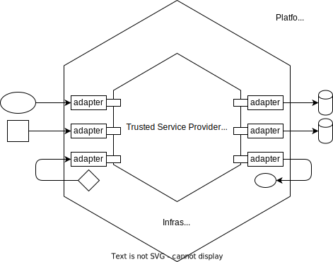

Service Deployment Model
========================

A goal of the Trusted Services project is to provide a toolbox of reusable service components
that can be deployed across a wide range of platforms. The project structure promotes reuse by
grouping related source files into subdirectories that represent reusable components. Components
may be configured and combined in different ways to meet the needs of platform integrators who
aim to create firmware with the right features and tradeoffs for their products.

Within the TS project structure, build files that combine and configure components to create
deployable firmware images reside under the deployments top-level directory. Beneath the
deployments parent are sub-directories concerned with building and deploying different
applications. Applications can generally be classified as one of the following:

  - Service providers (e.g. psa-crypto)
  - Test suites (e.g. ts-service-test)
  - Libraries (e.g. libts)
  - Development support applications (e.g. fwu-tool)

This page is mainly concerned with describing the conventions used to enable service providers
to be deployed in different environments, on different platforms and with different capabilities.
The conventions aim to minimize build definition duplication between alternative deployments
while offering sufficient flexibility to customize capabilities and support different platforms.

Ports and Adapters Architecture
-------------------------------

An application is decoupled from any particular environment via a set of interfaces that reflect
the needs of the application. This model conforms to the ports and adapters architectural
pattern that aims to avoid tight coupling between application components and any particular
environment. This pattern, also known as the hexagonal architecture, is often illustrated as a
hexagonal cell with the application on the inside and the platform on the outside.

The following diagram illustrates how ports and adapters is applied in the trusted services
project to provide a model for service provider deployment.

This deployment model has the following characteristics:

  - The application is decoupled from the environment by a set of virtual interfaces (ports)
    that reflect the needs of the application.
  - Ports are realized by a set of adapters. An adapter may:

      * Use a service/device provided by the platform or environment.
      * Communicate with another service provider.
      * Provide a self-contained implementation.
  - The set of adapters that the application depends on represents the infrastructure that is
    needed to support the application.
  - Different infrastructure realizations may be needed for different deployments of the same
    service provider.

Service Deployment Structure
----------------------------

By convention, the directory structure for service provider deployments reflects the layers in
the ports and adapters architecture. The following dependency diagram illustrates the set of
relationships that exist for a fully defined deployment:

.. uml:: uml/ServiceDeploymentDependencies.puml

To avoid undesirable build definition duplication when adding new deployments of an application,
the directory structure used to organize files related to different deployments should reflect
the above model. The following table lists reusable build components that may be used across
different deployment definitions:

.. list-table::
  :widths: 10 20 20
  :header-rows: 1

  * - Build Component
    - Defines
    - Reuse Scope
  * - Deployment
    - | Represents an application. Examples: a service provider, demo application, test application,
      | some tool.
    - | -
  * - Infrastructure
    - | A specific set of SW components that realize the ports that the application depends on.
      | An infrastructure definition may depend on:

        * Drivers that conform to a driver model.
    - | Any deployment that uses the same infrastructure to support the application.
      | This will depend on how specific the infrastructure is.  An infrastructure
      | definition may allow for some level of configurability to enable a deployment
      | to impose a particular build configuration. Where an infrastructure includes
      | adapters that use a well supported driver model (such as UEFI), the scope
      | for reuse is large.
  * - Environment
    - | The set of environment specific components that are common across all
      | deployments of an application for a particular environment.
    - | All deployments of the application into a specific environment. There is
      | scope to improve reuse of environment specific components across multiple
      | deployments.
  * - Configuration
    - | Build configuration variables together with a particular application, infrastructure
      | and environment. Represents a specific build of the application.
    - | None.
  * - Platform
    - | A specific set of hardware drivers and target platform specific settings.
      | A platform definition may depend on:

            * Hardware driver ports defined by various components.
            * Hardware specific resources.
            * Target specific resource selection.
    - | None.

Deployment Directory Structure
------------------------------
Using the block-storage deployment as an example, the deployment directory structure reflects
the service deployment model as follows::

  deployments
      |- block-storage
              |- block-storage.cmake     - Common application build definition
              |- env                     - Environment specific build definitions
              |- infra                   - Alternative infrastructures
              |- config                  - Configurations for block-storage deployments

Configuration Definitions
^^^^^^^^^^^^^^^^^^^^^^^^^
To build a particular configuration of the block-storage service provider (in this case, one
that uses flash storage emulated with semihosting on the AEM FVP platform), use::

  cd deployments/block-storage/config/semihosted-opteesp
  cmake -B build
  cmake --build build

The CMakeLists.txt file for the n1sdp-flash deployment of the block-storage service provider
includes:

  - Set TS_PLATFORM to n1sdp platform name
  - Set any build configuration parameter overrides
  - Include ``${DEPLOYMENT_ROOT}/env/opteesp.cmake``
  - Include ``${DEPLOYMENT_ROOT}/infra/edk2-flash.cmake``
  - Include ``${DEPLOYMENT_ROOT}/block-storage.cmake``

Each alternative deployment of the block-storage service provider is represented by a
subdirectory under ``${DEPLOYMENT_ROOT}/config``. The number of directories under config is
likely to grow to accommodate platform variability and different tradeoffs for how the infrastructure
for an application will be realized.

To support test and to provide a starting point for new config definitions, a default config should
exist for each supported environment.

Infrastructure Definitions
^^^^^^^^^^^^^^^^^^^^^^^^^^
An infrastructure defines a set of adapter components that realize the ports that the application
depends on. For block-storage deployments, some possible infrastructures are:

.. list-table::
  :header-rows: 1
  :widths: 10, 40

  * - Infra Name
    - Description
  * - ref-ram
    - Provides volatile storage using the reference partition configuration. Intended for test.
  * - edk2-flash
    - Provides persistent storage using a flash driver that conforms to the EDK2 driver model.
  * - tfa-flash
    - Provides persistent storage using a flash driver that conforms to the TF-A driver model.
  * - rpmb
    - Provides persistent storage using an RPMB partition, accessed via a Nwd agent.

Platform Support
----------------
The Trusted Services project is not intended to be a home for platform specific code such as
device drivers. Ideally, device drivers and other platform specific code should be reused
from external upstream repos such as edk2-platforms. The ports and adapters pattern allows
alternative driver models to be accommodated so different upstream projects with different
driver models may be used without the need to modify driver code. Where driver reuse from
an external project is not possible, the platform directory structure can accommodate driver
components that reside within the TS project.

The ability to accommodate third-party device drivers that conform to different driver models
is important for enabling TS components to be used across different segments. The EDK2
project for example can provide a rich source of drivers that conform to the UEFI model.
UEFI is not however adopted in all product segments.

All files related to supporting different platforms reside beneath the platform top-level
directory.

Platform Providers
^^^^^^^^^^^^^^^^^^
Within the TS project, a platform provider is responsible for adding and maintaining the
glue that enables platform specific code to be used from a particular source. The platform
code will either be:

  - Fetched from an upstream repo (preferred)
  - Added to the TS project.

Each platform provider is represented by a subdirectory beneath ``platform/providers``. For
Arm provided platforms, the structure will look something like this::

  platform
      |-- providers
              |--arm
                  |-- Corstone1000
                  |-- fvp
                      |-- fvp_base_aemva
                      |-- fvp_base_revc-2xaemv8a
                                  |-- platform.cmake

Under each platform leaf directory is a file called ``platform.cmake``. This file implements
the common configuration and build interface that will be used during the deployment build
process. How this interface is realized is entirely down to the platform provider. An
implementation will do things like setting configuration variables for SoC, board and driver
selection. Any additional files needed to support platform configuration and build may be
included within the platform provider's sub-tree.

For product developers who want to define and maintain their own private platforms, it should
be possible to override the default ``platform/providers`` directory path to allow an
alternative sub-tree to be used.  A product developer is free to organize a private sub-tree
in any way that suites their needs.

Although the TS project structure doesn't mandate it, platform specific firmware is likely
to live outside of the TS project. The ability to reuse existing drivers and driver frameworks
is important for promoting adoption across hardware from different vendors.  Board and silicon
vendors may reuse existing CI and project infrastructure for platform components that they
maintain.

Platform support that depends on EDK2 platform components is represented by the edk2 platform
provider. Files related to the EDK2 platform provider are organized as follows::

  platform
    |- providers
          |- edk2
              |- edk2-platforms.cmake            - Fetches the upstream edk2-platforms repo
              |- platform                        - Directory for platform definitions, organized by contributor
                    |- arm
                        |- n1sdp
                              |- platform.cmake

Some special platforms are provided by the TS project itself. These are represented beneath
the ts provider. Current TS platforms are:

.. list-table::
  :header-rows: 1
  :widths: 10, 90

  * - TS Platform
    - Purpose
  * - ``ts/vanilla``
    - | A platform that never provides any drivers. The ``ts/vanilla`` platform should be used when an environment provides its own
      | device framework and no additional drivers need to be provided by the platform. An attempt to build a deployment with
      | platform dependencies on the vanilla platform will result in a build-time error. The vanilla platform is selected by
      | default at build-time if no explicit platform has been specified.
  * - ``ts/mock``
    - | A platform that provides a complete set of drivers that may be selected when building any deployment. The platform uses
      | mock drivers that don't offer functionality suitable for production builds. The mock platform is useful for CI build
      | testing of deployments with platform dependencies. You should always expect a deployment with platform dependencies to
      | build when ``TS_PLATFORM=ts/mock``.

Diver Models
^^^^^^^^^^^^
Alternative driver models are represented by subdirectories beneath ``platform/driver_model``.
Driver code imported from an external project, such as edk2-platforms, will also depend on
interface and other header files related to the driver model.  For drivers reused from
edk2-platforms, the driver interface header files will define interface structures defined
by the UEFI specification. The following example illustrates two driver models, one for
UEFI drivers from the EDK2 project and another for bare-metal drivers that conform to TS
defined interfaces::

  platform
    |- driver_model
            |- edk2
            |- baremetal

Header files under the driver_model/edk2 directory will either explicitly provide definitions for
the EDK2 driver model or include definitions from an external component. To maintain compatibility
with driver code imported from edk2-platforms, sub-directories beneath platform/driver_model/edk2
should conform to the EDK2 directory structure and naming conventions. The following illustrates
how UEFI driver model files are organized::

  platform
    |- driver_model
            |- edk2
                |- interface
                        |- Protocol
                        |      |- BlockIo.h
                        |      |- DiskIo.h
                        |      |- FirmwareVolumeBlock.h
                        |
                        |- Library
                        |      |- IoLib.h
                        |      |- DebugLib.h

Drivers
^^^^^^^
The platforms/drivers directory provides a home for CMake files that enable driver code to be built
as part of the the deployment build process. Source files will either have been fetched from an
upstream repo or will live under the ``platform/drivers`` parent.

--------------

*Copyright (c) 2021-2022, Arm Limited and Contributors. All rights reserved.*

SPDX-License-Identifier: BSD-3-Clause
