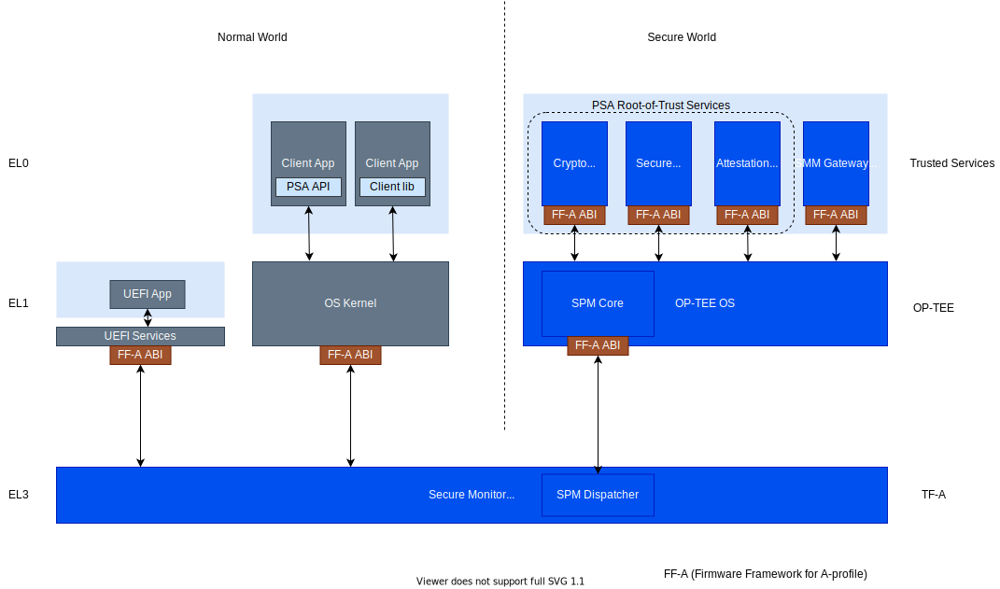

Introduction
============

The term 'trusted service' is used as a general name for a class of application that runs in an isolated
processing environment. Other applications rely on trusted services to perform security related operations in
a way that avoids exposing secret data beyond the isolation boundary of the environment. The word 'trusted'
does not imply anything inherently trustworthy about a service application but rather that other applications
put trust in the service. Meeting those trust obligations relies on a range of hardware and firmware
implemented security measures.

The Arm Application-profile (A-profile) architecture, in combination with standard firmware, provides a range
of isolated processing environments that offer hardware-backed protection against various classes of attack.
Because of their strong security properties, these environments are suitable for running applications that have
access to valuable assets such as keys or sensitive user data. The goal of the Trusted Services project is
to provide a framework in which security related services may be developed, tested and easily deployed to
run in any of the supported environments. A core set of trusted services are implemented to provide basic
device security functions such as cryptography and secure storage.

Example isolated processing environments are:

    - **Secure partitions** - secure world isolated environments managed by a secure partition manager
    - **Trusted applications** - application environments managed by a TEE
    - **VM backed container** - container runtime that uses a hypervisor to provide hardware backed container isolation

The default reference system, used for test and development, uses the Secure Partition Manager configuration
of OP-TEE to manage a set of secure partitions running at S-EL0. The secure partitions host service providers
that implement PSA root-of-trust services. Services may be accessed using client-side C bindings that expose PSA
Functional APIs. UEFI SMM services are provided by the SMM Gateway.

.. The image was exported from an original on Arm Confluence.

For more background on the type of problems solved by trusted services and how the project aims to
make solutions more accessible, see:

.. toctree::
    :maxdepth: 1

    example-usage
    goals

The Trusted Services project includes components that may be integrated into platform firmware
to enable A-profile platforms to meet PSA Certified security requirements. For more information, see:
:ref:`Platform Certification`.

--------------

*Copyright (c) 2020-2022, Arm Limited and Contributors. All rights reserved.*

SPDX-License-Identifier: BSD-3-Clause
