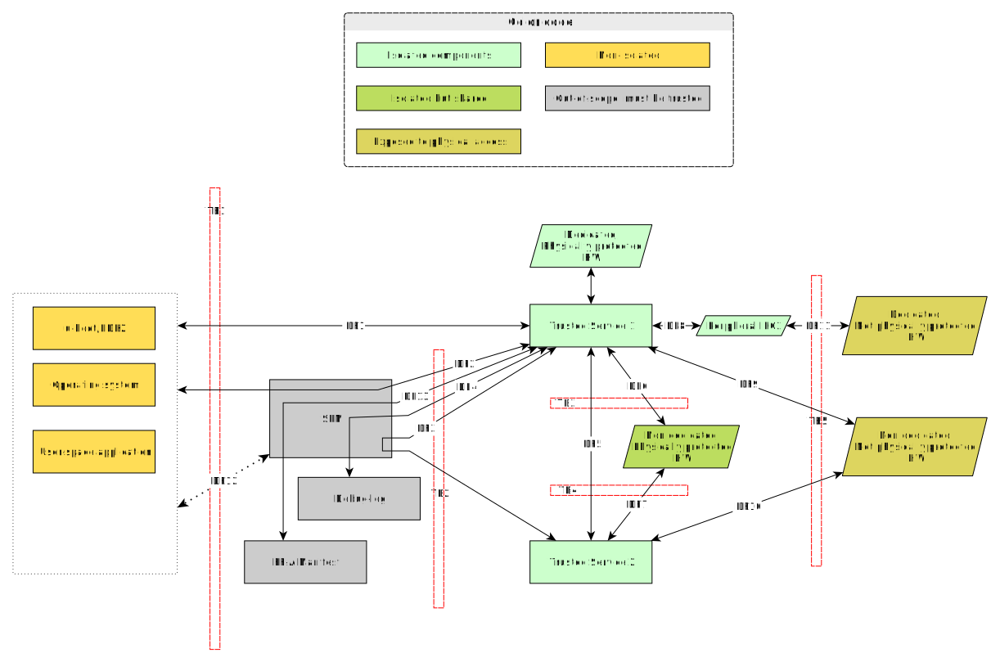

Generic Threat Model
====================

The Generic Threat Model discusses an abstract physical Secure Partition and captures service independent security
related information like assets, threats, and mitigations.

This model serves as the foundation for assessing the security of any specific deployment involving one or more Trusted
Services.

Target evaluation
-----------------

In this threat model, the target of evaluation is the S-EL0 SPs part of the PSA RoT hosting a "generalized" trusted
service.

This evaluation is based on the following assumptions:

    * The implementation is based on the |FF-A| standard.
    * Trusted boot is enabled. This means an attacker can’t boot arbitrary images that are not approved by platform
      providers.
    * Each trusted service is running in an S-EL0 secure partition. Access to memory and hardware is controlled by the
      SPM based on the FF-A manifest or FF-A framework messages.
    * Components running at higher privilege levels than S-EL0 are to be inherently trusted. (I.e. the SPM).

Data flow diagram
-----------------

The data flow diagram visualizes the connection between components and where the data flow crosses security boundaries.

.. list-table:: List of generic data flows
    :header-rows: 1
    :widths: auto

    * - Data flow
      - Description
      - In scope
    * - DF1
      - Trusted Service interacts with NWd client directly.
      - Yes
    * - DF2
      - Trusted Service interacts with NWd client through SPM.
      - Yes
    * - DF3
      - Trusted Services interact through SPM.
      - Yes
    * - DF4
      - Trusted Service logs debug information.
      - Yes
    * - DF5
      - Trusted Services interact directly.
      - Yes
    * - DF6, DF7
      - Trusted Services interacts with shared hardware.
      - Yes
    * - DF8
      - Trusted Service interacts with dedicated peripheral interface.
      - Yes
    * - DF9, DF10
      - Trusted Service interacts with shared, external hardware.
      - Yes
    * - DF11
      - Trusted Service interacts with dedicated, external hardware.
      - Yes
    * - DF12
      - NWd interacts with more privileged software.
      - No
    * - DF13
      - FF-A manifest and other data is handed over to a Trusted Service
      - No
    * - DF14
      - Trusted Service interacts with dedicated, physically protected hardware.
      - Yes

It is worth highlighting two different dataflow types between the service and its clients:
    1. Direct communication through shared memory. DF1 and DF5 represents this type of communication and it may be
       sensitive to TOCTTOU attacks. See threat 10 below.
    2. Indirect communication through registers. DF2 and DF3 represents this type. This type is more secure and less
       performant.

Trust boundaries
----------------

.. list-table:: List of trust boundaries
    :header-rows: 1
    :widths: auto

    * - Trust boundary
      - Description
    * - TB1
      - Trust boundary between TEE and normal world.
    * - TB2
      - Trust boundary between higher privilege level SW and Trusted Services.
    * - TB3, TB4
      - Trust boundary between trusted services.
    * - TB5
      - Trust boundary to physically accessible external hardware.

Assets
------

The above dataflow identifies the following generalized assets.

.. list-table:: Assets
    :header-rows: 1
    :widths: auto

    * - Asset
      - Description
    * - ``availability``
      - Availability of a trusted service to clients.
    * - ``code execution``
      - Code or code flow of a trusted service.
    * - ``sensitive data``
      - Data that an attacker must not tamper with. These include device identity key, Initial Attestation Key,
        Protected Storage Key, UEFI variables, TPM event log.
    * - ``sensitive hardware``
      - Hardware that an attacker must not be tamper with. Examples are control interface of storage medium, true
        random number generator, crypto accelerator.

Attackers and threat agents
---------------------------

This section identifies the generalized stakeholders interacting with secure services.

.. list-table::
    :header-rows: 1
    :widths: 20,70,10

    * - Attacker/Threat agent
      - Description
      - In scope
    * - ``NSClient``
      - Client executing in the normal world.
      - Yes
    * - ``SClient``
      - Client running in SWd.
      - Yes
    * - ``HPComponent``
      - Components running at higher privilege level than the trusted service.
      - No
    * - ``AppDebug``
      - Physical attacker using debug signals to access resources.
      - Yes
    * - ``PhysAcc``
      - Physical attacker having access to the external device communication bus and to the external flash communication
        bus using common hardware.
      - Yes
    * - ``AdvPhysAcc``
      - Attackers who are able to use specialist hardware for attacks that require irreversible changes to the target
        system (e.g., "rewiring" a chip using a Focused IonBeam FIB workstation).
      - No

.. _generic_threat_priority:

Threat Priority
---------------

Threat priority calculation is based on `Common Vulnerability Scoring System`_ (CVSS) Version 3.1. The threat priority
is represented by the `Severity Rating Scale`_ calculated from the CVSS score of each threat. The CVSS score is
calculated using the `Vulnerability Calculator`_.

For each threat the priority and a link to CVSS calculator capturing the calculator settings will be listed.

.. _generic_threat_types:

Threat Types
------------

In this threat model we categorize threats using the `STRIDE threat analysis technique`_. In this technique a threat is
categorized as one or more of these types: ``Spoofing``, ``Tampering``, ``Repudiation``, ``Information disclosure``,
``Denial of service`` or ``Elevation of privilege``.

.. _generic_threat_1:

.. list-table::
    :widths: 15,80
    :width: 100%

    * - **ID**
      - GEN1
    * - Description
      - Information leak via debug logs.

        During development it is common practice to help understanding code execution by emitting
        debug logs.
    * - Data flow
      - DF4
    * - Asset(s)
      - ``Sensitive Data``
    * - Threat Agent/Attacker
      - ``AppDebug``
    * - Threat type
      - ``Information disclosure``
    * - Impact
      - Sensitive information may get to unauthorized people. Information can potentially help
        compromising the target or other systems.
    * - Scoring/CVSS
      - Medium, 4.6 `CVSS:3.1/AV:P/AC:L/PR:N/UI:N/S:U/C:H/I:N/A:N <https://www.first.org/cvss/calculator/3.1#CVSS:3.1/AV:P/AC:L/PR:N/UI:N/S:U/C:H/I:N/A:N>`_
    * - Mitigation
      - Log messages are put to "verbosity categories". Release builds limit printed log messages
        to "error" category.
    * - Mitigation in place
      - yes

.. _generic_threat_2:

.. list-table::
    :widths: 15,80
    :width: 100%

    * - **ID**
      - GEN2
    * - Description
      - An attacker can tamper with sensitive data and execute arbitrary code through hardware-assisted
        debug interface.
    * - Data flow
      - N/A.
    * - Asset(s)
      - ``Sensitive Data``, ``Code Execution``, ``Sensitive Hardware``
    * - Threat Agent/Attacker
      - ``AppDebug``
    * - Threat type
      - ``Information disclosure``, ``Tampering``
    * - Impact
      - Sensitive information may get to unauthorized people. Information can potentially help
        compromising the target or other systems.

        An attacker may modify sensitive data and alter device behavior and thus compromise the
        target or other systems.
    * - Scoring/CVSS
      - Medium, 6.8 `CVSS:3.1/AV:P/AC:H/PR:H/UI:R/S:C/C:H/I:H/A:H <https://www.first.org/cvss/calculator/3.1#CVSS:3.1/AV:P/AC:H/PR:H/UI:R/S:C/C:H/I:H/A:H>`_
    * - Mitigation
      - Hardware platform specific means to disable or limit access to debug functionality.
    * - Mitigation in place
      - yes

.. _generic_threat_3:

.. list-table::
    :widths: 15,80
    :width: 100%

    * - **ID**
      - GEN3
    * - Description
      - An attacker can perform a denial-of-service attack by using a broken service call that
        causes the service to enter an unknown state.

        Secure and non-secure clients access a trusted service through FF-A calls. Malicious code
        can attempt to place the service into an inconsistent state by calling unimplemented
        calls or by passing invalid arguments.
    * - Data flow
      - DF1, DF2, DF3, DF5
    * - Asset(s)
      - ``Availability``
    * - Threat Agent/Attacker
      - ``NSclient``, ``SClient``
    * - Threat type
      - ``Denial of service``
    * - Impact
      - The service or the whole system may temporarily or permanently enter an unusable state.
    * - Scoring/CVSS
      - Medium, 6.8 `CVSS:3.1/AV:L/AC:L/PR:N/UI:N/S:U/C:N/I:L/A:H <https://www.first.org/cvss/calculator/3.1#CVSS:3.1/AV:L/AC:L/PR:N/UI:N/S:U/C:N/I:L/A:H>`_
    * - Mitigation
      - The service must validate all inputs before usage. Input validation shall be checked during
        code review and by testing.
    * - Mitigation in place
      - yes

.. _generic_threat_4:

.. list-table::
    :widths: 15,80
    :width: 100%

    * - **ID**
      - GEN4
    * - Description
      - Memory corruption due to memory overflows and lack of boundary checking when accessing
        resources.

        Allows an attacker to execute arbitrary code, modify memory content to change
        program flow.
    * - Data flow
      - DF1, DF2, DF3, DF5
    * - Asset(s)
      - ``Code execution``, ``Sensitive Data``, ``Denial of service``
    * - Threat Agent/Attacker
      - ``SClient``, ``NSClient``, ``HSComponent``
    * - Threat type
      - ``Tampering``, ``Information disclosure``, ``Elevation of privilege``, ``Denial of service``
    * - Impact
      - The service or the whole system may temporarily or permanently enter an unusable state.

        Malicious code might be executed in the context of the compromised service.
        Leakage of sensitive data.
    * - Scoring/CVSS
      - High, 8.4 `CVSS:3.1/AV:L/AC:L/PR:N/UI:N/S:U/C:H/I:H/A:H <https://www.first.org/cvss/calculator/3.1#CVSS:3.1/AV:L/AC:L/PR:N/UI:N/S:U/C:H/I:H/A:H>`_
    * - Mitigation
      - The service must validate boundaries and sanity check incoming data. Validation shall be
        checked during code reviews and by testing.
    * - Mitigation in place
      - yes

.. _generic_threat_5:

.. list-table::
    :widths: 15,80
    :width: 100%

    * - **ID**
      - GEN5
    * - Description
      - External devices connected to the system storing sensitive data. An attacker could eavesdrop external signals.
    * - Data flow
      - DF9, DF10, DF11
    * - Asset(s)
      - ``Sensitive Data``
    * - Threat agent/Attacker
      - ``PhysAcc``
    * - Threat type
      - ``Information disclosure``
    * - Impact
      - An attacker may get access to sensitive data, could tamper with sensitive data, or could attack the service
        using the external device by injecting malicious data, which could lead to malfunction or execution of malicious
        code.
    * - Scoring/CVSS
      - Medium, 5.9 `CVSS:3.1/AV:P/AC:L/PR:N/UI:R/S:U/C:H/I:N/A:H <https://www.first.org/cvss/calculator/3.1#CVSS:3.1/AV:P/AC:L/PR:N/UI:R/S:U/C:H/I:N/A:H>`_
    * - Mitigation
      - When designing the use case, storage services must be assessed to understand which protection type they can
        implement (integrity, authenticity, confidentiality, rollback-protection). Sensitive data must be categorized
        and mapped to the storage service which can provide the needed protection.

        For example integrity can be safeguarded by using checksums. Authenticity by using digital signatures.
        Confidentiality by using encryption. Rollback protection by using nonce values.
    * - Mitigation in place
      - yes

.. _generic_threat_6:

.. list-table::
    :widths: 15,80
    :width: 100%

    * - **ID**
      - GEN6
    * - Description
      - State of external devices connected to the system might be modified by an attacker.

        This includes modifying signals, replacing the device, or modifying device content.
    * - Data flow
      - DF9, DF10, DF11
    * - Asset(s)
      - ``Sensitive Data``, ``Denial of service``, ``Code execution``
    * - Threat agent/Attacker
      - ``PhysAcc``
    * - Threat type
      - ``Tampering``, ``Denial of service``, ``Code execution``
    * - Impact
      - An attacker could tamper with sensitive data, or could attack the system by injecting malicious data, which
        could lead to malfunction, execution of malicious code, or using old state with known vulnerability.
    * - Scoring/CVSS
      - High, 7.3 `CVSS:3.1/AV:P/AC:L/PR:N/UI:R/S:C/C:H/I:H/A:H <https://www.first.org/cvss/calculator/3.1#CVSS:3.1/AV:P/AC:L/PR:N/UI:R/S:C/C:H/I:H/A:H>`_
    * - Mitigation
      - When designing the use case, storage services must be assessed to understand which protection type they can
        implement (integrity, authenticity, confidentiality, rollback-protection). Sensitive data must be categorized
        and mapped to the storage service which can provide the needed protection.

        For example integrity can be safeguarded by using checksums. Authenticity by using digital signatures.
        Confidentiality by using encryption. Rollback protection by using hardware backed nonce values.
    * - Mitigation in place
      - yes

.. _generic_threat_7:

.. list-table::
    :widths: 15,80
    :width: 100%

    * - **ID**
      - GEN7
    * - Description
      - Invalid or conflicting access to shared hardware.

    * - Data flow
      - DF6, DF7, DF9, DF10
    * - Asset(s)
      - ``Sensitive Data``, ``Denial of service``, ``Code execution``
    * - Threat Agent/Attacker
      - ``SClient``, ``NSClient``, ``HPComponent``
    * - Threat type
      - ``Tampering``, ``Information disclosure``, ``Denial of service``, ``Code execution``
    * - Impact
      - A trusted service relying on shared hardware usage might get compromised or misbehaving if other stakeholders
        affect shared hardware in unexpected way.

    * - Scoring/CVSS
      - High, 7.0 `CVSS:3.1/AV:L/AC:H/PR:L/UI:N/S:C/C:L/I:L/A:H <https://www.first.org/cvss/calculator/3.1#CVSS:3.1/AV:L/AC:H/PR:L/UI:N/S:C/C:L/I:L/A:H>`_
    * - Mitigation
      - Access to peripherals must be limited to the smallest possible set of services. Ideally each peripheral should be
        dedicated to a single trusted service and sharing of peripherals should be avoided is possible. If sharing can
        not be avoided, a strict handover process shall be implemented to allow proper context switches, where hardware
        state can be controlled.
    * - Mitigation in place
      - yes

.. _generic_threat_8:

.. list-table::
    :widths: 15,80
    :width: 100%

    * - **ID**
      - GEN8
    * - Description
      - Unauthenticated access to hardware.

        A trusted service relying on hardware usage might get compromised or misbehaving if hardware state is
        maliciously altered.
    * - Data flow
      - DF6, DF7, DF9, DF10
    * - Asset(s)
      - ``Sensitive Data``, ``Denial of service``, ``Code execution``
    * - Threat Agent/Attacker
      - ``SClient``, ``NSClient``, ``HPComponent``
    * - Threat type
      - ``Tampering``, ``Information disclosure``, ``Denial of service``, ``Code execution``
    * - Impact
      - An attacker may get access to sensitive data of might make a trusted service or the system enter an unusable
        state by tampering with hardware peripherals.
    * - Scoring/CVSS
      - Medium, 6.4 `CVSS:3.1/AV:L/AC:H/PR:H/UI:N/S:U/C:H/I:H/A:H <https://www.first.org/cvss/calculator/3.1#CVSS:3.1/AV:L/AC:H/PR:H/UI:N/S:U/C:H/I:H/A:H>`_
    * - Mitigation
      - Access to peripherals must be limited to the smallest possible set of services. Ideally each peripheral should be
        dedicated to a single trusted service, and sharing of peripherals should be avoided is possible. If sharing can
        not be avoided, a strict handover process shall be implemented to allow proper context switches, where register
        values can be controlled.
    * - Mitigation in place
      - yes

.. _generic_threat_9:

.. list-table::
    :widths: 15,80
    :width: 100%

    * - **ID**
      - GEN9
    * - Description
      - Unauthenticated access to sensitive data.
    * - Data flow
      - DF1, DF2, DF3, DF5
    * - Asset(s)
      - ``Sensitive Data``, ``Denial of service``
    * - Threat Agent/Attacker
      - ``SClient``, ``NSClient``, ``HPComponent``
    * - Threat type
      - ``Tampering``, ``Information disclosure``, ``Denial of service``
    * - Impact
      - A trusted service may manage data of multiple clients. Different clients shall not be able to access each
        other's data unless in response to explicit request.
    * - Scoring/CVSS
      - Medium, 6.8 `CVSS:3.1/AV:L/AC:L/PR:N/UI:N/S:U/C:H/I:L/A:N <https://www.first.org/cvss/calculator/3.1#CVSS:3.1/AV:L/AC:L/PR:N/UI:N/S:U/C:H/I:L/A:N>`_
    * - Mitigation
      - Trusted services must implement access control based on identification data provided by higher privileged
        components (i.e. FF-A endpoint ID).
    * - Mitigation in place
      - yes

.. _generic_threat_10:

.. list-table::
    :widths: 15,80
    :width: 100%

    * - **ID**
      - GEN10
    * - Description
      - Time-of-Check to Time-of-Use (TOCTTOU) attack trough shared memory.
    * - Data flow
      - DF1, DF5
    * - Asset(s)
      - ``Sensitive Data``, ``Code execution``, ``Availability``
    * - Threat Agent/Attacker
      - ``SClient``, ``NSClient``
    * - Threat type
      - ``Tampering``, ``Information disclosure``, ``Denial of service``, ``Elevation of privilege``
    * - Impact
      - An attacker may cause incorrect operation of the service, and thus:
            - make the system enter an unusable state,
            - breach logical isolation boundary within the trust domain of the service and impersonate other client
            - execute unauthentic code.
    * - Scoring/CVSS
      - High, 7.4 `CVSS:3.1/AV:L/AC:H/PR:N/UI:N/S:U/C:H/I:H/A:H <https://www.first.org/cvss/calculator/3.1#CVSS:3.1/AV:L/AC:H/PR:N/UI:N/S:U/C:H/I:H/A:H>`_
    * - Mitigation
      - - The Trusted service must copy data to a private buffer when executing TOCTTOU sensitive operation.
        - The service implementation must not read the input buffer multiple times.
    * - Mitigation in place
      - yes

--------------

.. _Attachments:
.. Rubric:: Attachments

Source file of the `Data flow diagram`_. Please use the yEd_ for editing. :download:`./generic-data-flow.graphml`

--------------

.. _`Common Vulnerability Scoring System`: https://www.first.org/cvss/v3.1/specification-document
.. _`Vulnerability Calculator`: https://www.first.org/cvss/calculator/3.1
.. _`Severity Rating Scale`: https://www.first.org/cvss/v3.1/specification-document#Qualitative-Severity-Rating-Scale
.. _`STRIDE threat analysis technique`: https://docs.microsoft.com/en-us/azure/security/develop/threat-modeling-tool-threats#stride-model
.. _yEd: https://www.yworks.com/products/yed

*Copyright (c) 2022-2025, Arm Limited and Contributors. All rights reserved.*

SPDX-License-Identifier: BSD-3-Clause
