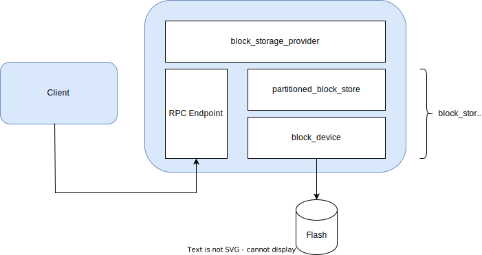

Block Storage Service
=====================
Overview
--------
The Block Storage service can be used to share a block-oriented storage device
such as a QSPI flash between a set of independent secure world clients. A block
storage service provider presents a block level interface for accessing an
underlying block storage device. The basic storage functionality provided by a
device can be extended by Stacked Block Stores, which add extra features, like
encryption or partitioning on top of a device.

The following diagram illustrates a firmware integration that uses a single block
storage service provider to control access to a dedicated flash device. In this
example StMM, OP-TEE, Update Agent and the Protected Storage SP act as clients of
the service.  Each client independently manages its own filesystem and is presented
with its own logical partition, starting with a logical block address (LBA) of zero.

.. image:: ../image/block-storage-example-usage.svg

Project Directories
-------------------
Components within the Trusted Services project related to the Block Storage service
are located under the following directories:

.. list-table::
  :header-rows: 1

  * - Directory
    - Contains
  * - ``components/service/block_storage``
    - Service specific code components.
  * - ``components/service/block_storage/block_store``
    - Client, devices, stacked block stores.
  * - ``deployments/block-storage``
    - Build files and deployment specific code for building alternative configurations
      of the block storage service provider.
  * - ``protocols/service/block_storage``
    - Service access protocol definitions.

Design Description
------------------
The block storage service provider conforms to the same model as other service providers
within the TS project. Service requests from clients are received by a service provider
that is responsible for parameter deserialization/serialization and service level access
control. Block storage operations are delegated to a backend *block_store* that provides
block-level storage in some way. There is much flexibility to realize the backend block-level
storage in different ways, allowing platform integrators to use alternative *block_store*
realizations to provide storage solutions that meet specific product requirements.

The following class diagram illustrates the block storage service provider model:

.. uml:: ../uml/BlockStorageProvider.puml

Block Store
^^^^^^^^^^^
The *block_store* component defines a virtual interface for block IO operations. Alternative
concrete *block_store* implementations are supported. Some *block_store* components are stackable
over other *block_store* components to add features such as store partitioning or block
authentication. Separation of functionality into stackable *block_store* components gives
platform integrators the flexibility to create alternative storage solutions with different
security/cost tradeoffs. The base *block_store* interface is defined in::

  components/service/block_storage/block_store/block_store.h

Components that implement the *block_store* interface are located in subdirectories beneath
``components/service/block_storage/block_store``. A *block_device* is class of *block_store*
that actually provides block-level storage. In a stack of *block_store* components, a
*block_device* will always live at the bottom. The following layer diagram illustrates a
typical block storage deployment where storage is provided by a stack of *block_store* components:

Service Interface
-----------------
The Block Storage service supports a conventional set of block-level operations that
can be adapted to different driver models by clients. The following table summarizes
supported operations:

.. list-table::
  :header-rows: 1

  * - Operation
    - Description
  * - Open
    - Open a session - take the required *UniquePartitionGUID* as a parameter. Returns
      a handle to be used as a qualifier for other requests made by a client.
  * - Close
    - Close a previously opened session.
  * - GetPartitionInfo
    - Returns information about the partition associated with an open session. Includes
      the block size and the total number of blocks assigned to the partition.
  * - Read
    - Read data from the specified block.
  * - Write
    - Write data to the specified block.
  * - Erase
    - Erase a set of one or more blocks.

The service interface is realized by the block storage service provider. It delegates
storage operations to a backend *block_store*. The *block_store* defines a common
interface for components that realize block storage operations. Where an underlying storage
technology does not support an explicit erase operation (e.g. RPMB), the corresponding
concrete *block_store* should return success for a call to erase but perform no actual
operation (if the partition is writable and the LBA falls within the limits of the
partition).

Block Store Client
------------------

Communicates with a remote block storage service provider to provide storage.

Block Store Devices
-------------------

  - **file_block_store** - stores blocks in file accessed using the standard C file (stdio.h) API.
    The file represents a contiguous array of storage blocks. Designed to be used in a POSIX
    environment as a virtual storage media.
  - **fvb_block_store** - an adapter that uses a UEFI firmware volume block driver to access
    storage. Can be used with drivers from the EDK2 project.
  - **mock_block_store** - mocked block store for unit testing.
  - **null_block_store** - a store with no real storage. Always accepts legal writes and returns
    zeros for reads.
  - **ram_block_store** - stores blocks in RAM. Intended for test purposes.
  - **rpmb_block_store** - it is a Replay Protected Memory Block device
    (see `SD Association home page`_) that uses the RPMB frontend to provide RPMB based storage.
  - **semihosting_block_store** - it is a block device that can be used on emulators
    (FVP, qemu, etc...) or on target platforms where the debugger can provide the file-system
    semihosting features (See `this page`_.). Semihosting allows accessing files from the host
    environment. This block store uses a single file to represent a contiguous array of storage
    blocks.

Stacked Block Stores
--------------------

Partitioned Block Store
^^^^^^^^^^^^^^^^^^^^^^^

To allow multiple higher layer filesystems to share the same storage device,
logical block addresses are partitioned, based on configuration data provided
by a system integrator. The partition configuration data may be read from a
GUID Partition Table (GPT) or from the block storage SP manifest. The
configuration data restricts access to a storage partition to a defined owner.
Each owner is allocated a maximum number of blocks and is given exclusive access
to its own blocks, based on the client ID of the calling client.

Storage Partition Configuration
"""""""""""""""""""""""""""""""
The block storage service allows a block storage device to be presented as a single storage
partition or as a set of smaller storage partitions. The way that storage is presented is
determined by configuration data prepared by a platform integrator. Each storage partition
presented by a block storage service provider starts at LBA zero. The number of partitions
and their size are defined by configuration data. Configuration data assigns partitions
to owners to enable access to be controlled. If no partition configuration exists for a
requesting client or if an attempt is made to access a block outside of the configured LBA
range, access is denied. The set of storage partitions used for secure block storage will
not necessarily span the entire underlying storage device. A platform integrator is free to
limit the area used for secure block storage to allow the storage device to be used for other
purposes e.g. as a boot source, read by the boot loader during early boot stages.

Two partition configuration methods will be supported; one where partition configuration data
is read from an SP manifest and the other where configuration is defined by a GUID Partition
Table. Both methods may be used in combination if necessary. Initial implementations will
use the SP manifest configuration method.

Each partition configuration entry includes an attributes bitmap that conforms to the UEFI
GPT Partition Entry attributes definition (see section 5.3 of the UEFI specification). Bits
48-63 are reserved for GUID specific use. For partitions labelled with the Secure Block Store
GUID, bits will be defined for:

  - **Read-only** - write and erase operations are forbidden.

A GPT partition entry includes the PartitionName property which normally holds a human readable
name for the partition. For secure block store partitions, the PartitionName property will
hold the canonical UUID string identifying the owner. An empty string is interpreted as
'no specific owner' and any client will be granted access.

Configuration via SP Manifest
"""""""""""""""""""""""""""""
For an SP deployment, the partition configuration may be read from a device tree blob (DTB),
passed as an initialization parameter. Per-partition configuration data comprises the following:

.. list-table::
  :header-rows: 1

  * - Config Value
    - Description
  * - UniquePartitionGUID
    - GUID that is unique for a partition entry.
  * - StartingLBA
    - The storage block address corresponding to LBA zero.
  * - EndingLBA
    - The last storage block in the contiguous range of blocks.
  * - Attributes
    - See UEFI specification
  * - Owner
    - Holds canonical UUID string for owner.

The partition configuration is included as a sub-node of the block-dev node that includes
configuration values related to the block device. The following is an example of how a block
device and related partitions are defined within a DT based SP manifest::

  block-dev {
    compatible = "tforg,ts-block-dev"
    disk-guid = "af9f72de-d71f-4492-b44b-a4b4d96000bf"

    partitions {
        compatible = "tforg,ts-block-partitions"

        fwu-meta {
            guid = "a6f99e90-7a75-4384-847a-29c9a86c6279"
            start-lba = <0x00000000>
            end-lba = <0x00000003>
            attr = <0x00000000>
            owner = "afb995cd-9354-4333-9ea2-bd62ccaedb22"
        };

        fip {
            guid = "1eccc9bc-9a5f-43d0-bcd3-466fd21c9a92"
            start-lba = <0x00000004>
            end-lba = <0x00040003>
            attr = <0x00000000>
            owner = "afb995cd-9354-4333-9ea2-bd62ccaedb22"
        };

        uefi-var {
            guid = "1022a92b-4b4a-47b4-94cb-35faf5a45dc2"
            start-lba = <0x00040004>
            end-lba = <0x00080003>
            attr = <0x00000000>
            owner = "ed32d533-99e6-4209-9cc0-2d72cdd998a7"
        };
    };
  };

Configuration via GUID Partition Table (GPT)
""""""""""""""""""""""""""""""""""""""""""""
The UEFI specification defines a standard layout for physical storage devices where storage
partitions are described by partition entries within the GUID Partition Table. During
initialization, the Block Storage SP will read the GPT and iterate over partition entries,
identifying those with the secure block store partition type GUID. Each entry contains the
following:

.. list-table::
  :header-rows: 1

  * - Offset
    - Length
    - contents
  * - 0
    - 16 bytes
    - PartitionTypeGUID - Secure Block Store GUID
  * - 16
    - 16 bytes
    - UniquePartitionGUID
  * - 32
    - 8 bytes
    - Starting LBA
  * - 40
    - 8 bytes
    - Ending LBA
  * - 48
    - 8 bytes
    - Attributes (e.g. read-only)
  * - 56
    - 72 bytes
    - PartitionName - Holds canonical UUID string for owner.

Encrypted Block Store
^^^^^^^^^^^^^^^^^^^^^

To provide data in rest, and data in transit protection for the stored data using encryption.
The current implementation uses *AES-CBC with ESSIV* encryption, where the encryption key is
derived from the Encryption Root key (ERK).
This way a unique, deterministic, but unpredictable vector is generated for each sector, which
mitigates IV prediction based attacks, like watermarking attack.
To implement the algorithm two keys are derived from the root key and generated with the same
salt value, but with different info:

  - **encryption key** - encryption and decryption of the data (AES with CBC block cipher mode)
  - **essiv key** - generation of the IV (AES with ECB block cipher mode)

Encrypted Block Store Configuration
"""""""""""""""""""""""""""""""""""

  - **ENCRYPTED_BLK_AES_KEY_BITS** - determines the size of the keys derived from the root key
    supported values are 128, 192 and 256.
  - **ENCRYPTED_BLK_BLOCK_ENCRYPTION_ROOT_KEY** - root key to be used to derive encryption
    and ESSIV keys from.
  - **ENCRYPTED_BLK_BLOCK_ENCRYPTION_SALT** - Salt value to make impossible for an attacker to
    derive the same keys as the ones used for encryption without knowing this value.

Encrypted Block Store Limitations
"""""""""""""""""""""""""""""""""

  - Block size of the store must be multiple of the AES block size (16 bytes).
  - Encryption root key is currently a configurable vector in the future it should come from a
    secure source, like from the Crypto SP or a separate SP responsible for root key storage and
    key derivation, but in the current implementation
  - AES with CBC block method encrypts a whole block, where the consecutive AES blocks are
    interconnected. A drawback of this algorithm is that partial read or write does not
    work. To mitigate this limitation at read request the whole block is read and only partial
    data is returned, at write request the read-modify-write methodology is used.

--------------

.. _`SD Association home page`: https://www.sdcard.org/developers/boot-and-new-security-features/replay-protected-memory-block/
.. _`this page`: https://developer.arm.com/documentation/dui0203/j/semihosting?lang=en

*Copyright (c) 2022, Arm Limited and Contributors. All rights reserved.*

SPDX-License-Identifier: BSD-3-Clause
