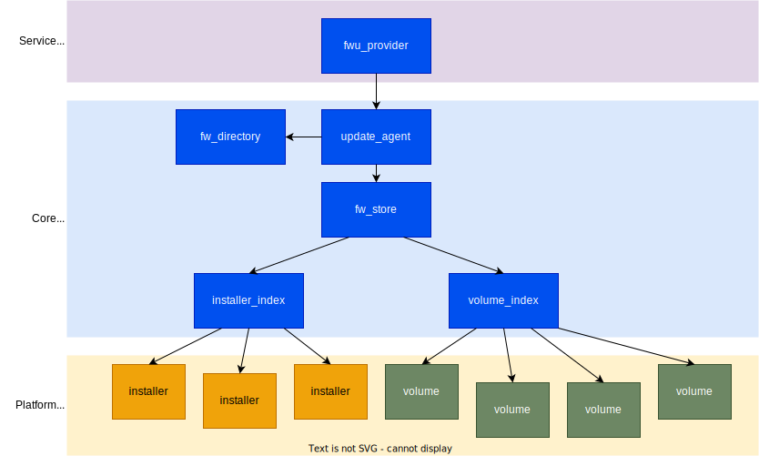
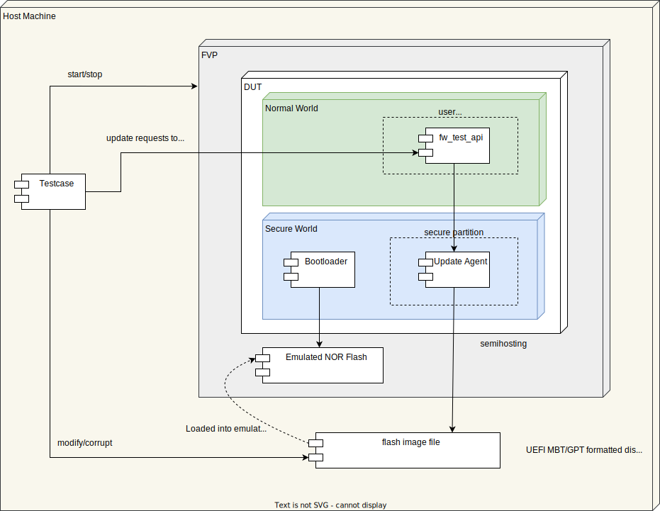

Overview
--------
The ability to update device firmware and related resources is a key requirement for
maintaining security over a device's lifetime. Keeping firmware up-to-date with security
fixes and feature enhancements is important for defending against emerging threats.
Because firmware forms the security foundation of a device, it is important to apply
updates in a timely manner to minimize risks exposed by firmware vulnerabilities. Any
remote firmware update mechanism carries a risk of failure. As firmware is critical to
the operation of a device, failures during the update process that lead to corrupted
firmware have the potential to be highly disruptive. Any update mechanism intended
for use with a large population of devices must offer robustness guarantees sufficient
to keep the risk of failure at an acceptable level.

Firmware update support within the Trusted Services project consists of a set of reusable
firmware components that can be deployed within different execution environments to enable
platform integrators to create firmware update solutions, tailored for their platform.
The components are intended to be integrated into platform firmware and will be used in
conjunction with a third-party update client, such as mender, swupd or fwupd, to create
an end-to-end solution. The features supported aim to meet requirements for robustness
and security. These include:

  - Banked A/B robust update support
  - Transactional multi-component updates with ACID (Atomicity, Consistency, Isolation,
    Durability) guarantees
  - Partial updates where not all components are updated
  - Trial of an update with bootloader or client initiated rollback
  - Anti-rollback counter management
  - Standardized signaling to bootloader via the FWU Metadata structure
  - Flexible installer framework to support different image types
  - Image directory for advertising updatable components
  - Compatible with UEFI FMP capsule update model and ESRT

To support test and development and to provide a useful reference, the Trusted Services
project maintains a reference integration with the following characteristics:

  - Dual flash system where firmware is loaded from a dedicated secure world flash device.
  - Secure flash is formatted with UEFI MBR/GPT with separate partitions for FWU metadata
    and firmware banks.
  - TF-A is used as the bootloader with separate firmware components packaged in a FIP
    image.
  - The Update Agent runs within a secure partition and exposes an FF-A based ABI that
    conforms to the `Arm FWU-A specification`_.
  - Test and development on supported :ref:`Target Platforms`.

Source Code Location
--------------------
Within the Trusted Services project, source code related to FWU can be found under the
following subdirectories (relative to the project root).

.. list-table::
  :header-rows: 1

  * - Directory
    - Contains
  * - components/service/fwu
    - Service components for implementing the FWU service provider.
  * - protocols/service/fwu
    - Public service access protocol (ABI) definition.
  * - components/media/volume
    - Storage volume access.

Testing is covered in more detail in a later section. However, if you want a simple way
of building and testing FWU components, the component-test deployment may be built for a
native PC environment. The built executable includes an extensive set of FWU related tests
that exercise the core Update Agent in various configurations. To build and run these tests
on a Linux PC, use the following (from TS root directory):

.. code-block:: bash

    mkdir -p ~/compt-linux-pc
    cmake -S deployments/component-test/linux-pc -B ~/compt-linux-pc
    cmake --build ~/compt-linux-pc
    ~/compt-linux-pc/component-test -v -g Fwu

Output will look like this::

    TEST(FwuCopyInstallerTests, installAndCopy) - 1 ms
    TEST(FwuRawInstallerTests, normalInstallFlow) - 1 ms
    TEST(FwuMetadataManagerTests, checkAndRepairInaccessibleStorage) - 0 ms
    TEST(FwuMetadataManagerTests, checkAndRepairAccessibleStorage) - 1 ms
    TEST(FwuRollbackTests, bootloaderFallback) - 0 ms
    TEST(FwuRollbackTests, selectPreviousAfterActivation) - 0 ms
    TEST(FwuRollbackTests, selectPreviousPriorToActivation) - 0 ms
    TEST(FwuPowerFailureTests, powerFailureDuringTrial) - 0 ms
    TEST(FwuPowerFailureTests, powerFailureDuringStaging) - 0 ms
    TEST(FwuUpdateScenarioTests, partialFirmwareUpdateFlow) - 0 ms
    TEST(FwuUpdateScenarioTests, wholeFirmwareUpdateFlow) - 0 ms
    TEST(FwuInvalidBehaviourTests, invalidOperationsInTrial) - 0 ms
    TEST(FwuInvalidBehaviourTests, invalidOperationsInStaging) - 0 ms
    TEST(FwuInvalidBehaviourTests, invalidOperationsInRegular) - 0 ms
    TEST(FwuImageDirectoryTests, zeroFwLocations) - 0 ms
    TEST(FwuImageDirectoryTests, multipleFwLocations) - 0 ms
    TEST(FwuImageDirectoryTests, singleFwLocation) - 1 ms
    TEST(FwuImageDirectoryTests, streamRecycling) - 0 ms
    TEST(FwuImageDirectoryTests, streamedReads) - 0 ms

    OK (234 tests, 19 ran, 3452 checks, 0 ignored, 215 filtered out, 5 ms)

Concepts and Assumptions
------------------------
Before describing details of the design, some important concepts and assumptions are
introduced in this section.

Update Packaging
''''''''''''''''
A set of firmware images that forms an update will be packaged in some way to enable
it to be delivered to a device for installation. No particular packaging method is assumed
by the FWU Update Agent. Any unpacking will be performed before individual images are
presented to the FWU service for installation. The only assumption that the Update Agent
relies on is that each image is identified by an image type UUID/GUID. The UEFI specification
defines the FMP Capsule format that acts as a container for a set of arbitrary images. The
reference integration maintained by the Trusted Services project uses UEFI FMP capsules
but the FWU service can be used with any packaging method.

Transactional Updates
'''''''''''''''''''''
A firmware update package may contain multiple images that all need to be installed as a
set in order to successfully update a device's firmware. To avoid the hazard of booting
a device using partially installed firmware, the FWU-A specification supports transactional
updates where as set of separate image install operations are grouped together to form a
single update transaction. The FWU-A specification defines a behavioral model where images
are installed during the *STAGING* state.  Entry to the *STAGING* state is triggered by the
client making the ``fwu_begin_staging`` ABI call. This is followed a set of one or more install
operations where images are written to the Update Agent. After committing the final image
in the set, the client marks the end of the transaction by calling ``fwu_end_staging``.

Banked Firmware Store
'''''''''''''''''''''
To offer the guarantee that device firmware is never left in an unbootable state, a valid
version of firmware is always held in flash. Flash storage is organized into A and B banks
where one bank holds a valid set of images while updates are installed in the other bank.
The bootloader is capable of booting from either bank, as instructed by the FWU metadata
written by the Update Agent. Where firmware storage is distributed across multiple locations,
A and B volumes must exist for each location.

Update Agent
''''''''''''
The Update Agent is a logical component defined in the FWU-A specification reference model.
The Update Agent handles requests from a client to install a set of images in preparation
for activating the updated firmware. In the TS project, the role of the Update Agent is
reflected by a firmware component with the same name.

Firmware Directory
''''''''''''''''''
The FWU-A specification defines a stream endpoint that can be read by a client to obtain a
listing of updatable firmware components. In the TS implementation, this is backed by the
Firmware Directory component that is populated with information about the booted firmware.

Storage Volumes
''''''''''''''''
All NV storage accessed by the Update Agent is represented by a set of volume objects. A
volume presents a unit of storage as a seekable file with support for conventional file IO
operations. The volume provides a uniform interface for all storage operations performed by
the Update Agent. The volume uses and extends the *io_dev* driver model from the TF-A project.
Concrete volume objects can access different types of storage such as:

  - A raw flash device
  - A disk partition
  - Storage managed by a subsystem

Installers
''''''''''
Trusted Services FWU support provides a framework for updating arbitrary firmware images.
From the framework's perspective, an image is just a binary blob, identified by an image
type UUID. To allow for image format specific installation, a common installer interface is
defined to allow for alternative concrete installers. Installers can update the entire
contents of a volume or modify parts of a volume.  Where a volume holds a container such
as a FIP, a specialized installer with knowledge of the container format can provide finer
grain updates of the container contents. An installer implements an enumerate method to
return information about images that it can handle. The Firmware Directory is formed by
aggregating the information returned by each installer's enumerate method.

Firmware Locations
''''''''''''''''''
The Update Agent can manage firmware distributed across multiple locations e.g. different
flash partitions, different flash devices or different subsystems. The concept of a firmware
location is used in the TS implementation to provide a generalized model for handling
distributed firmware. Each location is assigned an integer ID that is used to bind together:

  - A pair of storage volumes (for A + B banks)
  - A set of one or more installers. The set of installers configured for the location
    determines which image types are updatable for the location.

Installers are categorized as one of the following types:

  - **Whole volume installer** - updates the entire contents of a volume. The whole volume
    contents is presented as an entry in the firmware directory.
  - **Sub-volume installer** - updates components contained within a volume. Each image
    contained within the active volume is presented as an entry in the firmware directory.
  - **Whole volume copy installer** - copies entire volume contents from one volume to
    another. Contributes no entries to the firmware directory.

A platform integrator is responsible for selecting which installers are configured for a
location. Each location must be assigned at least one installer. Any combination of different
types of installer could make sense in a platform configuration. Here are some example
configurations:

.. list-table::
  :header-rows: 1

  * - Location configuration
    - Update capability for location
  * - *WholeVolumeInstaller*
    - A single entry appears in the firmware directory for the location that corresponds to
      the entire volume contents. An incoming update package must include an image that
      corresponds to the directory entry.
  * - *WholeVolumeInstaller + SubVolumeInstaller*
    - Firmware directory entries appear for the whole volume and for each updatable component
      contained within the volume. An incoming update package must include either one or more
      sub-volume images or a whole volume image for this location.
  * - *WholeVolumeInstaller + SubVolumeInstaller + WholeVolumeCopyInstaller*
    - Firmware directory entries appear for the whole volume and for each updatable component
      contained within the volume. If no image for this location is included in an incoming
      update package, the currently active volume contents is copied to the update volume.
  * - *WholeVolumeCopyInstaller*
    - This configuration can be used if it is necessary to prevent updates for a location.
      For any update transaction, the currently active volume contents will always be copied
      to the update volume for this location.

Design Description
------------------
FWU components within the TS project are designed for reuse in alternative deployments. The
project currently maintains two FWU deployments, both sharing many common components:

  - **fwu/config/default-sp** - the Update Agent runs within a secure partition. The client
    invokes ABI operations via FF-A based RPC. Updates are applied to a dedicated SWd flash device.
  - **fwu-tool/linux-pc** - the Update Agent runs within a command-line application.
    Updates are applied to a disk image file residing in the host filesystem.

There is clear separation between different classes of component making component-level reuse
straight-forward. The following diagram illustrates the main FWU components. The direction of
the arrows linking components shows the direction of a dependency between associated
components (i.e. A→B means that A depends on B).

Core Components
''''''''''''''''
Any FWU deployment that supports a banked firmware store is expected to use the core set of
FWU components. Core components are partitioned between:

  - **Generic Update Agent** - manages update transactions and streams used for transferring
    image data. Also owns the FW Directory.
  - **Banked FW Store** - manages banked access to storage and communication with the bootloader
    via FWU metadata.

Generic Update Agent Model
""""""""""""""""""""""""""
The following class diagram models the generic Update Agent:

.. uml:: ../uml/UpdateAgentClassDiagram.puml

Classes in the model perform the following roles:

.. list-table::
  :header-rows: 1

  * - Class
    - Description
    - Source files
  * - *update_agent*
    - Coordinates update transactions from start to finish. Implements the FWU state machine that
      enforces correct behaviour during an update. Provides functions that form the public interface
      for an instance of the Update Agent.
    - components/service/fwu/agent/update_agent.h, components/service/fwu/agent/update_agent.c
  * - *stream_manager*
    - Manages a pool of stream objects for client initiated stream read and write operations. Streams
      are used for writing image data and reading FWU objects such as the image directory.
    - components/service/fwu/agent/stream_manager.h, components/service/fwu/agent/stream_manager.c
  * - *fw_directory*
    - Holds information about the currently active firmware. The contents of the fw_directory is
      updated by a fw_inspector at boot time. Forms the source of the information returned to a
      client that reads the image directory object.
    - components/service/fwu/agent/fw_directory.h, components/service/fwu/agent/fw_directory.c
  * - *img_dir_serializer*
    - Serializes information about currently active firmware in-line with the FWU-A specification.
    - components/service/fwu/agent/img_dir_serializer.h, components/service/fwu/agent/img_dir_serializer.c
  * - *fw_inspector*
    - Called by the update_agent to inspect firmware and update the contents of the fw_directory to
      provide a fresh view of active firmware. To allow for alternative inspection strategies, the
      concrete fw_inspector to use is determined by deployment specific configuration code and passed
      to the update_agent at initialization. The direct_fw_inspector is a concrete fw_inspector that
      relies on direct access to the set of installers registered as part of the Update Agent configuration.
    - components/service/fwu/inspector/fw_inspector.h, components/service/fwu/inspector/direct/direct_fw_inspector.h,
      components/service/fwu/inspector/direct/direct_fw_inspector.c

Banked FW Store Model
""""""""""""""""""""""
The update_agent interacts with the fw_store via a common interface. No details about the nature of the fw_store
are exposed to the update_agent. The following class diagram models a particular realization of the fw_store
interface that implements the A/B bank scheme:

.. uml:: ../uml/FwStoreClassDiagram.puml

Classes in the model perform the following roles:

.. list-table::
  :header-rows: 1

  * - Class
    - Description
    - Source files
  * - *fw_store*
    - Manages updates to banked storage volumes.
    - components/service/fwu/fw_store/fw_store.h,
      components/service/fwu/fw_store/banked/banked_fw_store.h,
      components/service/fwu/fw_store/banked/banked_fw_store.c
  * - *bank_tracker*
    - Tracks usage and accepted state of firmware banks.
    - components/service/fwu/fw_store/banked/bank_tracker.h,
      components/service/fwu/fw_store/banked/bank_tracker.c
  * - *metadata_manager*
    - Manages storage and updates to the FWU metadata used for signaling to the bootloader. Responsible for
      detecting and repairing corrupted metadata.
    - components/service/fwu/fw_store/banked/metadata_manager.h,
      components/service/fwu/fw_store/banked/metadata_manager.c
  * - *metadata_serializer*
    - Serializes update bank state in a standard format for compatibility with the boot loader. To ensure
      version compatibility through fw updates, alternative realizations of the metadata_serializer may be
      selected at runtime. Currently support for V1 and V2 formats (as defined by the FWU-A specification).
    - components/service/fwu/fw_store/banked/metadata_serializer/metadata_serializer.h
  * - *installer*
    - Base class for installers. Defines a common interface for installing images associated with a location.
    - components/service/fwu/installer/installer.h,
      components/service/fwu/installer/installer.c
  * - *installer_index*
    - Holds pointers to the set of concrete installers registered during platform configuration.
    - components/service/fwu/installer/installer_index.h,
      components/service/fwu/installer/installer_index.c
  * - *volume*
    - Presents a unit of storage is a seekable file.  Supports byte-orient read and writes operation
      to storage. All NV storage is accessed by the Update Agent using volumes. The set of volume objects
      needed for a deployment are created as part of platform specific initialisation.
    - components/media/volume/volume.h,
      components/media/volume/volume.c
  * - *volume_index*
    - Holds pointers to the set of concrete volumes registered during platform configuration.
    - components/media/volume/index/volume_index.h,
      components/media/volume/index/volume_index.c

Service Interface
''''''''''''''''''
For deployments where the Update Agent needs to be remotely callable, the fwu_provider implements an
RPC interface that accepts call requests, de-serializes call parameters and calls the corresponding
interface functions provided by the update_agent. In the reference deployment, where the Update
Agent runs within an SP, the fwu_provider receives call requests, made via FF-A, and returns responses
to the remote client. The fwu_provider may be used with any RPC layer where remote calling is required.

Platform Configuration
----------------------
A platform specific configuration tells the Update Agent about storage for firmware and defines the
policy for the way the firmware can be update. Configuration steps result in the creation of:

  - A set of concrete installer objects registered with the installer_index. This defines the
    type of images that can be updated.
  - A set of concrete volume objects registered with the volume_index. This defines where images
    can be installed.

Each installer is assigned a location ID to bind the installer to a particular firmware location.
Location IDs are integer values defined by the configuration code. For example, where firmware
consists of AP firmware, SCP firmware and RSE firmware, location IDs could be assigned as follows:

.. list-table::
  :header-rows: 1

  * - Location
    - ID
  * - AP firmware
    - 0
  * - SCP firmware
    - 1
  * - RSE firmware
    - 2

When volume objects are added to the volume index, each one is assigned a volume ID which is
formed by combining the corresponding location ID with the bank index to which the volume
provides access to.

The types of installer and volume needed will depend on factors such as:

  - How NV storage is accessed by the Update Agent.
  - The type of images that need to be installed.
  - How flash storage is partitioned e.g. is GPT used or some other partition description method.

Source files related to FWU configuration:

.. list-table::
  :header-rows: 1

  * - Directory
    - Contains
  * - components/service/fwu/config
    - Configuration strategies for provisioning installers and volumes
  * - components/service/fwu/installer/factory
    - Factories for constructing different types of installer
  * - components/media/volume/factory
    - Factories for constructing different types of volume

Update Agent Configuration using GPT
''''''''''''''''''''''''''''''''''''
The TS FWU service implementation includes a GPT based configurator that automatically discovers
the set of installers and volumes to construct, based on the contents of the GPT that describes
the flash layout. The following diagram illustrates a typical flash partition layout. Note that
not all partitions contain firmware.

.. image:: ../image/gpt-based-flash-layout.svg

A deployment of the Update Agent is built with an installer factory that has the capability to
construct a set of installers that are suitable for a family of platforms where common image
types and update policy applies. An installer factory is capable of constructing a concrete set
of installers for installing images into a particular set of partitions, identified by partition
type GUID. A platform may not incorporate the complete set of partition types. The default
installer factory (under components/service/fwu/installer/factory/default) includes rules for
constructing installers for:

  - **AP Firmware** - where application firmware is contained within a FIP
  - **SCP Firmware** - binary boot image for SCP
  - **RSE Firmware** - binary boot image for RSE

The GPT based configurator relies on access to the GPT partition table. During initialization
of the Update Agent, the configurator iterates over each partition entry. If no installers are
registered for the partition, the partition type GUID is offered to the installer factory. If
at least one installer is constructed, a volume object is constructed to provide access to the
partition. This partition will hold one of the banked copies of the image identified by the
partition type GUID. If one or more installers have already been constructed for the partition
type GUID, an additional volume object is constructed to provide access to the second
banked partition.

The designation of bank index to partition is determined from the PartitionName field in the
partition entry.  The first UTF-16 character (0 or 1) is interpreted as the bank index assigned
to the partition. Different conventions are possible if an alternative configurator is used.

FWU Command Line Application
----------------------------
The *fwu-tool* deployment integrates the Update Agent within a command-line application that can be
run on a Linux PC. Instead of updating images stored in flash, the application operates on a GPT
formatted disk image file residing in the host machine's filesystem. (Refer to :ref:`UEFI disk image
creation instructions` to see how a disk image can be created.) The core components of the
application are identical to those used in embedded deployments. To build and run the fwu
application, use the following commands from the root of the checked-out TS project:

.. code-block:: bash

    mkdir -p ~/fwu-tool
    cmake -S deployments/fwu-tool/linux-pc -B ~/fwu-tool
    cmake --build ~/fwu-tool

    ~/fwu-tool/fwu-tool -h
    Usage: fwu disk-filename [-dir -meta] [-boot-index number -meta-ver number] [-img filename -img-type uuid]

        disk-filename	Disk image file to update
        -dir		Print image directory
        -meta		Print FWU metadata
        -boot-index	Override default boot index [0..n]
        -meta-ver	Specify FWU metadata to use
        -img		File containing image update
        -img-type	Canonical UUID of image to update

Some sample disk image files can be found under ``components/media/disk/disk_images``

The sample disk image file *multi_location_fw.img* includes a GPT with entries for the firmware
and metadata partitions illustrated in the diagram above. Note that the sample disk image
does not contain valid FWU metadata within the primary and backup metadata partitions. This
condition is detected by the Update Agent which writes valid metadata that reflects the contents
of the disk image file. Subsequent invocations of the app will use the valid metadata previously
written to the disk image.

The app can of course be used with flash image files created by a firmware build system.
The command-line interface currently restricts updates to consist of just a single image,
identified by an image type UUID. Extending the command-line interface to support multi-image
update transactions is possible by for example adding the capability to process an FMP capsule
file containing multiple images.

Testing the Update Agent
------------------------
FWU components are tested in both native PC and embedded environments. PC based tests use the
*fwu_dut* C++ class to simulate the role of the bootloader and to allow device reboot scenarios
to be recreated. The simulated device-under-test maintains NV storage state through reboots
to mimic real device behaviour. Test components that support PC based testing are summarized
in the following table:

.. list-table::
  :header-rows: 1

  * - Component
    - Description
    - Project Directory
  * - *fwu_dut*
    - Base class to represent a device-under-test (DUT). Presents an interface used by test
      cases that allows for test-case reuse with different fwu_dut specializations.
    - components/service/fwu/test/fwu_dut
  * - *sim_fwu_dut*
    - A specialization of the fwu_dut class that adds bootloader simulation and various
      other test support capabilities.
    - components/service/fwu/test/fwu_dut/sim
  * - *proxy_fwu_dut*
    - A specialization of the fwu_dut class that acts as a proxy for the fwu_dut that
      actually hosts the Update Agent.
    - components/service/fwu/test/fwu_dut/proxy
  * - *fwu_client*
    - Presents FWU methods (begin_staging, end_staging etc.) for use by test cases.
    - components/service/fwu/test/fwu_client
  * - *direct_fwu_client*
    - An fwu_client that calls Update Agent interface functions directly.
    - components/service/fwu/test/fwu_client/direct
  * - *remote_fwu_client*
    - An fwu_client that makes RPC call requests to invoke Update Agent operations. Call
      parameters are serialized using the FWU access protocol.
    - components/service/fwu/test/fwu_client/remote
  * - *image_directory_checker*
    - A test support class that fetches the serialized image directory and provides
      methods for checking the fetched content.
    - components/service/fwu/test/image_directory_checker
  * - *metadata_checker*
    - Provides methods to check that the fetched FWU metadata reflects the state expected
      by test cases. Decouples test code from the underlying metadata format. Support
      for V1 and V2 metadata is provided.
    - components/service/fwu/test/metadata_checker
  * - *metadata_fetcher*
    - Provides an interface for fetching the metadata associated with the DUT. Depending
      on the deployment, different strategies for fetching the metadata are needed.
    - components/service/fwu/test/metadata_fetcher

An extensive set of test suites uses the test framework components listed above to test
various update scenarios. The following test suites live under ``components/service/fwu/test/ref_scenarios``

.. list-table::
  :header-rows: 1

  * - Test Suite
    - Description
  * - *image_directory_tests*
    - Tests reading of the image directory via the Update Agent stream interface.
  * - *invalid_behaviour_tests*
    - Tests to check that invalid requests are rejected with the expected error codes.
  * - *oversize_image_tests*
    - Tests to check defenses against attempts to install images that are too big for
      the available storage.
  * - *power_failure_tests*
    - Tests recreate power-failure scenarios at various points during an update transaction.
      Tests check that a viable set of firmware is always available.
  * - *rollback_tests*
    - Tests recreate bootloader initiated and update client requested rollback scenarios.
  * - *update_scenario_tests*
    - Various normal update scenarios with a well-behaved client.

The test suites list above are included in the following TS test deployments:

  - **component-test** - runs tests in a native PC environment using a *direct_fwu_client*.
  - **ts-service-test** - runs tests in a native PC environment using a *remote_fwu_client*.

Reference Integration Test Environment
--------------------------------------
The following diagram provides an overview of the planned reference integration and test
environment used for testing on FVP.

--------------

_`Arm FWU-A specification`: https://developer.arm.com/documentation/den0118

*Copyright (c) 2023, Arm Limited and Contributors. All rights reserved.*

SPDX-License-Identifier: BSD-3-Clause
