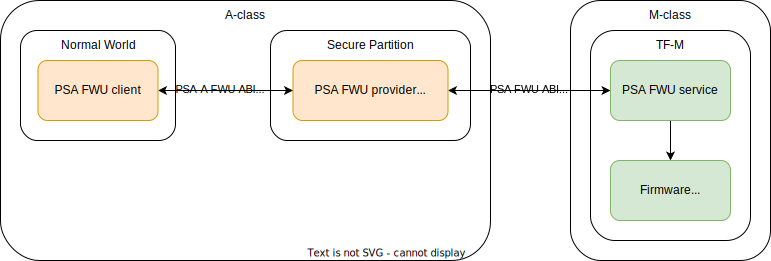

Firmware update on A+M systems
------------------------------

Concept
'''''''

Some platforms have both Cortex-A and Cortex-M subsystems and implement the PSA RoT on the M class core. On such systems
the firmware store is usually read-only or not accessible to the Cortex-A cores due to security reasons. In such cases
it may still be beneficial to implement the cloud update client on the Cortex-A subsystem, and a solution is needed to
bridge the Cortex-A and the Cortex-M firmware update implementations. For this purpose TS implements a special firmware
update agent which is documented below.



   Components on an A+M system.

Standards and specifications
''''''''''''''''''''''''''''

* `Platform Security Firmware Update for the A-profile Arm Architecture`_ (A class FWU specification)
* `PSA Certified Firmware Update API 1.0`_ (M class FWU specification)
* `Trusted Firmware-M FWU service`_

Update agent implementation
'''''''''''''''''''''''''''

The update agent implements the `Platform Security Firmware Update for the A-profile Arm Architecture`_ API (prefixed
with ``fwu_``) and acts as a `PSA Certified Firmware Update API 1.0`_ client (prefixed with ``psa_fwu_``). The update
agent has to align the slightly different APIs by maintaining an internal registry of image states and image handles.
The differences between the two firmware update protocols are:

* `Platform Security Firmware Update for the A-profile Arm Architecture`_ identifies images by UUID while
  `PSA Certified Firmware Update API 1.0`_ identifies component by an 8 bit component ID.
* Although similar calls are implemented, FWU-A operates on images, while FWU-M on the whole image set.
* There is no *image handle* concept in `PSA Certified Firmware Update API 1.0`_
* Differences in the returned details of the image query functions

The solutions to these differences:

* A static UUID to component ID mapping is used. This has to be passed to the agent init function.
* Gathering per image based calls and then make the actual call to the M class side when the operation was called on
  each image.
* Implement internal image handle registry.
* Convert the image query result returned by FWU-M to FWU-A format. There are similar field, but this imposes some
  limitations.

Initialization
```````````````

The initial image and agent state is determined based on the image state returned by ``psa_fwu_query()``.


``fwu_discover()``
``````````````````

This function returns the list of implemented features.

``fwu_begin_staging()``
```````````````````````

Clients can only write images in staging state. In order to switch to staging state, the client must call
``fwu_begin_staging()``. This results in ``psa_fwu_start()`` calls on all selected images. The client can pass a list of
the selected image UUIDs or select all images for staging.

If the agent is already in staging state when ``fwu_begin_staging()`` is called, then the agent first discards all
transient state by calling ``fwu_cancel_staging()`` and ``psa_fwu_clean()`` on all image.

.. uml:: ../uml/psa_fwu_m_update_agent/fwu_begin_staging.puml

``fwu_end_staging()``
`````````````````````

Finishes the staging state when all images that were selected for the update have been updated. If all selected images
are also accepted the agent switches to regular state and the update is completed. If there are not accepted images, the
agent switches to trial state, so the client can validate the new set of images and accept or reject them.

On calling ``fwu_end_staging()`` the agent calls ``psa_fwu_finish()`` on each selected image, then calls
``psa_fwu_install()``. If all images have been accepted (see ``fwu_commit()``) it also calls ``psa_fwu_accept()``.
The implementation treats ``PSA_SUCCESS_REBOOT`` and ``PSA_SUCCESS_RESTART`` status values as error. In an A+M system the M
class side shouldn't restart the system, so calling ``psa_fwu_request_reboot()`` does not fit the system. There's also no
PSA FWU A return code for inidicating the restart request to the normal world. If the normal world has to restart the
system after ending the staging phase, it has to do it in an implementation defined way.

.. uml:: ../uml/psa_fwu_m_update_agent/fwu_end_staging.puml

``fwu_cancel_staging()``
````````````````````````

Cancels staging state and reverts to original regular state. The function calls ``psa_fwu_cancel()`` on each selected
image.

.. uml:: ../uml/psa_fwu_m_update_agent/fwu_cancel_staging.puml

``fwu_open()``
``````````````

`Platform Security Firmware Update for the A-profile Arm Architecture`_ has a concept of image handles. An image can be
opened via ``fwu_open()``, then accessed by calling ``fwu_write_stream()`` or ``fwu_read_stream()``, and finally it can
be closed by invoking ``fwu_commit()``. However `PSA Certified Firmware Update API 1.0`_ does not have a similar concept
and once the staging process was started for an image by calling ``psa_fwu_start()``, the image can be written through
``psa_fwu_write()``.

The update agent provides an internal registry of opened images and their access rights so it can handle subsequent
calls on the image handle. The open call can open an image for either write or read operations but not for both. The
image is identified by its UUID. Only images which were selected for staging can be opened for write.

There is no actual call made to the M class side on opening a image.

`PSA Certified Firmware Update API 1.0`_ does not provide a function for reading images, so opening images will fail
except for opening the image directory. Only the image directory supports read operations.

``fwu_write_stream()``
``````````````````````

This function writes data into the opened image. The image handle has to be opened for write operations. The agent calls
``psa_fwu_write()`` for doing the actual write and the write offset is tracked internally.

``fwu_read_stream()``
`````````````````````

This function read data from the opened image. The image handle has to be opened for read operations.

This call is only implemented for the image directory which returns the available image list as specified in
`Platform Security Firmware Update for the A-profile Arm Architecture`_. It does not support the partial reading of the
image directory.

``fwu_commit()``
````````````````

The commit call closes the image handle. The client can also mark the image as accepted on commit and this the method
for accepting all images before calling ``fwu_end_staging()``.

There is no actual call made to the M class side on comiting an image.

``fwu_accept_image()``
``````````````````````

`PSA Certified Firmware Update API 1.0`_ only provides a ``psa_fwu_accept()`` function which accepts the whole set of
selected images. In order to align with the ``fwu_accept_image()`` API, it only marks the given image as accepted and
calls ``psa_fwu_accept()`` when all images have been accepted. This results in a state transition to regular state.

.. uml:: ../uml/psa_fwu_m_update_agent/fwu_accept.puml

``fwu_select_previous()``
`````````````````````````

Selects previous working state (i.e. rejects the firmware update) and transitions back to regular state after calling
``psa_fwu_reject()``. The implementation treats ``PSA_SUCCESS_REBOOT`` and ``PSA_SUCCESS_RESTART`` status values as error.
In an A+M system the M class side shouldn't restart the system, so calling ``psa_fwu_request_reboot()`` does not fit the
system. There's also no PSA FWU A return code for inidicating the restart request to the normal world. If the normal
world has to restart the system when rejecting the installed firmware, it has to do it in an implementation defined way.

.. uml:: ../uml/psa_fwu_m_update_agent/fwu_select_previous.puml

Image directory
'''''''''''''''

The client can read the image directory by opening and reading an image with dedicated UUID
(``deee58d9-5147-4ad3-a290-77666e2341a5``). On image directory read, the agent will call ``psa_fwu_query()`` on each
image and convert the value of similar fields.

* The UUID is based on the UUID - component ID mapping passed upon agent initialization.
* The images only support write operation due to FWU-M limitation.
* The image maximal size is copied from the component info structure.
* The lowest accepted version is set to 0.
* The image version is converted from the fields of the component info structure into a single 32 bit value. The build
  field is dropped due to lack of space in the 32 bit field.
* The images is marked accepted if its state in the component info structure is ``PSA_FWU_UPDATED``.

.. uml:: ../uml/psa_fwu_m_update_agent/image_directory.puml

--------------

.. _`Platform Security Firmware Update for the A-profile Arm Architecture`: https://developer.arm.com/documentation/den0118/latest/
.. _`PSA Certified Firmware Update API 1.0`: https://arm-software.github.io/psa-api/fwu/1.0/
.. _`Trusted Firmware-M FWU service`: https://tf-m-user-guide.trustedfirmware.org/design_docs/services/tfm_fwu_service.html

*Copyright (c) 2024, Arm Limited and Contributors. All rights reserved.*

SPDX-License-Identifier: BSD-3-Clause
