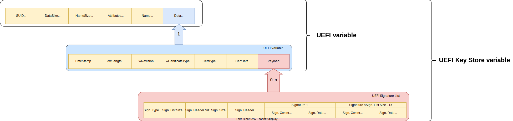

UEFI SMM Services
=================
The Trusted Services project provides support for UEFI System Management Mode (SMM) services via the
SMM Gateway secure partition. The SMM Gateway adopts the API Gateway design pattern, popular in
microservices architecture. The pattern decouples clients from backend service providers using an
API gateway that presents a domain specific interface to clients while delegating operations to a
set of backend microservices. An API gateway will typically use multiple backend services and may
perform protocol translation while presenting a single service entry point for clients. The SMM
Gateway works in a similar manner - clients access SMM services using standard SMM protocol messages,
carried by an RPC mechanism. Service requests are forwarded by the SMM Gateway to backend service
providers for operations such as secure persistent storage and signature verification.

SMM Gateway is intended to be used on non-EDK2 platforms as an alternative to the EDK2 StandaloneMM
(StMM) component. The current SMM Gateway version only supports the SMM Variable service. Additional
SMM service providers may be added to SMM Gateway if required. By deliberately limiting functionality
and exploiting backend services, the SMM Gateway SP can be significantly lighter-weight than StMM.
This option is intended to be used on more resource constrained devices that tend to use u-boot.
There is of course the possibility that other SMM services will need to be supported in the future.
In such cases, a judgement should be made as to whether StMM should be used rather than extending the SP.

.. uml:: uml/SmmGatewayOverview.puml

SMM Variable Service
--------------------
Overview
''''''''
UEFI Variable support is provided by the *smm_variable* service provider component. This service provider
is structured in the same way as other service providers within the TS project. Features of this
component are:

  * Source file location:  ``components/service/uefi/smm_variable``
  * Public interface definitions: ``protocols/service/smm_variable``
  * Can be used with any RPC layer - not tied to MM Communicate RPC.
  * Volatile and non-volatile storage is accessed via instances of the common *storage_backend* interface.

The *smm-gateway/opteesp* and *smm-gateway/sp* deployments integrate the *smm_variable* service provider with the following:

  * An MM Communicate based RPC endpoint.
  * A *mock_store* instance for volatile variables.
  * A *secure_storage_client* for non-volatile variables.
  * A *crypto client* for signature verification.

During SP initialization, the *smm-gateway* uses pre-configured information to discover a backend secure
storage SP for NV storage and a crypto SP to verify signatures needed for UEFI variable authentication.
Crypto SP is accessible only if UEFI_AUTH_VAR is enabled.

The following diagram illustrates how the *smm_variable* service provider is integrated into the *smm-gateway*.

.. image:: image/smm-gateway-layers.svg

Because the *smm_variable* service provider is independent of any particular environment, alternative deployments
are possible e.g.

  * *smm_variable* service provider running within a GP TA with storage off-loaded to the GP TEE Internal API.
  * *smm_variable* service provider running within a secure enclave with its own internal flash storage.

Supported Functions
'''''''''''''''''''
The *smm_variable* service provider supports the following functions:

.. list-table::
  :header-rows: 1

  * - SMM Variable Function
    - Purpose
    - Backend service interaction
  * - SMM_VARIABLE_FUNCTION_GET_VARIABLE
    - Get variable data identified by GUID/name.
    - Query index and get object from appropriate storage backend.
  * - SMM_VARIABLE_FUNCTION_GET_NEXT_VARIABLE_NAME
    - Called multiple times to enumerate stored variables.
    - Find variable in index and return next.
  * - SMM_VARIABLE_FUNCTION_SET_VARIABLE
    - Adds a new variable or updates an existing one.
    - | Sets object in storage backend and if necessary, updates index
      | and syncs to storage.
  * - SMM_VARIABLE_FUNCTION_QUERY_VARIABLE_INFO
    - Returns information about the variable store.
    - Iterates over stored variables to determine space used.
  * - SMM_VARIABLE_FUNCTION_EXIT_BOOT_SERVICE
    - Called by OS when boot phase is complete.
    - | Updates view of runtime state held by smm_variable service provider.
      | State variable used when implementing state dependent access control.
  * - SMM_VARIABLE_FUNCTION_VAR_CHECK_VARIABLE_PROPERTY_SET
    - | Set constraints that are checked on the SetVariable operation.
      | Allows a platform to set check policy.
    - | Variable index holds variable check constraints object for each variable.
      | This is updated by this function.
  * - SMM_VARIABLE_FUNCTION_VAR_CHECK_VARIABLE_PROPERTY_GET
    - Get the variable check constraints.
    - Reads the variable check constraints object.
  * - SMM_VARIABLE_FUNCTION_GET_PAYLOAD_SIZE
    - | Returns the maximum variable data size, excluding any
      | auth header.
    - | Considers size constraints imposed by backend stores and RPC response
      | payload constraints.

Supported Variable Attributes
'''''''''''''''''''''''''''''
The following variable attributes are supported:

.. list-table::
  :widths: 3 1 3
  :header-rows: 1

  * - SMM Variable Attribute
    - Support
    - Comment
  * - EFI_VARIABLE_NON_VOLATILE
    - yes
    - Determines which storage backend is used.
  * - EFI_VARIABLE_BOOTSERVICE_ACCESS
    - yes
    - Boot service access controlled by smm_variable service provider.
  * - EFI_VARIABLE_RUNTIME_ACCESS
    - yes
    - Runtime access controlled by smm_variable service provider.
  * - EFI_VARIABLE_HARDWARE_ERROR_RECORD
    - no
    - If the attribute contains this value, VariableName and VendorGuid must comply with the rules
      stated in Section 8.2.4.2 and Appendix P of the standard.
  * - EFI_VARIABLE_AUTHENTICATED_WRITE_ACCESS
    - no
    - DEPRECATED
  * - EFI_VARIABLE_ENHANCED_AUTHENTICATED_ACCESS
    - no
    - Authentication with EFI_VARIABLE_AUTHENTICATION_3 descriptor is enabled.
  * - EFI_VARIABLE_TIME_BASED_AUTHENTICATED_WRITE_ACCESS
    - yes
    - Authentication with EFI_VARIABLE_AUTHENTICATION_2 descriptor is enabled.
  * - EFI_VARIABLE_APPEND_WRITE
    - yes
    - Implemented by overwriting entire variable data.

Limitations
'''''''''''

.. list-table::
  :header-rows: 1

  * - Description
    - Value
  * - Maximum size of a single variable
    - 4096 bytes
  * - Supported type of signature list element
    - DER-encoded X.509 certificates
  * - Supported type of public keys
    - DER-encoded SignedData structure per PKCS#7 version 1.5, with or without a DER-encoded
      ContentInfo structure per PKCS#7 version 1.5.

Variable authentication
'''''''''''''''''''''''

UEFI variable authentication is a method to ensure that a UEFI variable can only be modified
by those who has proper rights. This restricts only the writing of these variables, while reading
is only limited by the state of the system (boot versus runtime access).

Key Store Variables
```````````````````
Key Store variables store authentication keys, and have predefined special names to specify the
keys scope (area of effect). When a write access to a variable with an active
EFI_VARIABLE_TIME_BASED_AUTHENTICATED_WRITE_ACCESS attribute is being made, the signature part of
the write access will be verified against the appropriate key Store variable.
Access will only be granted if the signature is valid.

The following table lists which Key Store variables defined by the UEFI standard are implemented.

.. list-table::
  :header-rows: 1

  * - Variable name
    - Description
    - Supported
  * - Platform Key (PK)
    - Root of trust. If it is not set the authentication is disabled, all write requests are successful.
    - yes
  * - Key Exchange Key Database (KEK)
    - Protects key store databases from unauthorized modifications.
    - yes
  * - Signature Database (db)
    - If a variable write request is signed by the public key whose private pair is
      stored here the authentication will pass.
    - yes
  * - Blacklist Signature Database (dbx)
    - Contains signatures of software that must not run on the platform.
    - no
  * - Authorized Recovery Signature Database (dbr)
    - Contains signatures of software that can be run for recovery.
    - no
  * - Timestamp Signature Database (dbt)
    - Same as db, but the timestamp of the certificate is also verified.
    - no

There is no support for initializing the values of the read-only global variables containing
default values of the key store variables (e.g. PKDefault, KEKDefault, etc.).

The following diagram shows variable authentication hierarchy.

*A → B means A has the right to verify write request to B*

.. uml::

    @startuml
    [PK]  --> [PK]
    [PK]  --> [KEK]
    [PK]  --> [db]
    [KEK] --> [db]
    [db]  --> [Common Variable]
    @enduml

Authenticated Variable Lifecycle
````````````````````````````````

.. uml::

    @startuml

    start
    if (Is authentication enabled?)
        if (Enable authentication?) then (yes)
            :Key Provision
            {{
                hide empty description

                state "Set PK" as keyprovision1
                state "Set KEK (write request must be signed by PK)" as keyprovision2
                state "Set db (write request must be signed with PK or KEK)" as keyprovision3

                keyprovision1 --> keyprovision2
                keyprovision2 --> keyprovision3
            }}
            ;
        endif
    else (yes)
        switch (Request)
        case (Clear store\n(disable authentication))
            :Clear Store
            {{
                hide empty description

                state "Delete PK (write request must be signed with PK)" as delete1
                state "Delete KEK or db (authentication is disabled, so signature is not verified)" as delete2

                delete1 --> delete2
            }}
            ;
        case (Update keys)
            :Key Update
            {{
                hide empty description

                state "Set PK (write request must be signed by original PK)" as keyupdate1
                state "Set KEK (write request must be signed by new PK)" as keyupdate2
                state "Set db (write request must be signed with new PK or new KEK)" as keyupdate3

                keyupdate1 --> keyupdate2
                keyupdate2 --> keyupdate3
            }}
            ;
        case (Reset factory keys)

            skinparam partitionBorderColor red
            partition "**NOT IMPLEMENTED**" {
                switch (Recovery method)
                case ()
                    :Using Setup Mode
                    {{
                        hide empty description

                        state "Enter Setup Mode to disable authentication" as recovery1
                        state "Delete PK, KEK, db (signatures are not verified in this mode)" as recovery2
                        state "Leave setup mode, but authentication is still disabled, because PK is empty" as recovery3

                        recovery1 -->recovery2
                        recovery2 -->recovery3
                    }}
                    ;
                case ()
                    :Using default keystores (PKdefault, KEKDefault, dbDefault);

                endswitch
            }

        case(None)
        endswitch
    endif

    end

    @enduml

Variable structure
``````````````````



|

* The elements of the signature verification are stored in or calculated from the fields of the variables:
    #. Hash: Calculated on Name, GUID, Attributes, Timestamp, Payload fields of the write request
    #. Public Key: Extracted from the 'Sign. Data' element of the Signature List field in the Payload
       of the variable responsible for authenticating the request
       (e.g. in case of KEK request, it will be extracted from PK)
    #. Signature: Extracted from the 'CertData' field of the write request.

SMM Variable Tests
''''''''''''''''''
The following test components exist for the SMM Variable service:

.. list-table::
  :header-rows: 1

  * - Test Component
    - Description
    - Included in deployments
  * - ``component/service/uefi/smm_variable/backend/test``
    - | Component tests for the variable_index and variable_store backend
      | components. Can be run in a native PC environment.
    - ``deployments/component-test/*``
  * - ``component/service/uefi/smm_variable/test/service``
    - | End-to-end service level tests that call service operations from
      | the perspective of a client.  Can be run in a native PC environment
      | or on the Arm target platform.
    - | ``deployments/ts-service-test/*``
      | ``deployments/uefi-test/*``

SMM Gateway Build Configuration
-------------------------------
The smm-gateway SP image may be built using the default configuration parameters defined
within relevant source files. In practice, it is likely that at least some configuration
values will need to be overridden. The following table lists build-time configuration
parameters that may be overridden by global C pre-processor defines.

.. list-table::
  :widths: 2 2 2 1
  :header-rows: 1

  * - Config define
    - Usage
    - File
    - Default value
  * - SMM_GATEWAY_MAX_UEFI_VARIABLES
    - Maximum number of variables
    - ``deployments/smm-gateway/common/smm_gateway.c``
    - 40
  * - UEFI_MAX_VARIABLE_SIZE
    - Maximum size of the uefi variables in bytes
    - ``components/service/uefi/smm_variable/backend/uefi_variable_store.c``
    - 4096
  * - SMM_GATEWAY_NV_STORE_SN
    - The service ID for the backend NV variable store
    - ``deployments/smm-gateway/common/smm_gateway.c``
    - Protected Storage SP
  * - SMM_GATEWAY_CRYPTO_SN
    - The service ID for the crypto backend
    - ``deployments/smm-gateway/common/smm_gateway.c``
    - Crypto SP
  * - UEFI_AUTH_VAR
    - Enables or disables UEFI variable authentication
    - ``components/service/uefi/smm_variable/backend/uefi_variable_store.c``
    - OFF

MM Communicate RPC Layer
------------------------
To maintain compatibility with existing SMM service clients, an MM Communicate based RPC
layer has been developed that uses the same 'carveout' buffer scheme as StMM. When SMM
Gateway is used instead of StMM, existing SMM variable clients should interoperate seamlessly.
The MM Communicate RPC components implement the standard TS RPC interfaces and can be used as
a general purpose RPC for calls from normal world to secure world. The following MM Communicate
RPC components have been added:

  * ``components/rpc/mm_communicate/endpoint/sp`` - an RPC endpoint that handles FFA direct
    calls with MM Communicate and SMM message carried in a shared 'carveout' buffer. Call requests
    are demultiplexed to the appropriate service interface based on the service GUID carried in
    the MM Communicate header.  Suitable for use in SP deployments.
  * ``components/rpc/mm_communicate/caller/linux`` - an RPC caller that calls service operations
    associated with the destination service interface from Linux user-space. Uses the MM Communicate
    protocol, sent over FFA using the Debug FFA kernel driver.  Service level tests that run against
    the SMM Gateway use this RPC caller for invoking SMM service operations.

The following register mapping is assumed for FFA based direct calls to an SP that handles the MM
Communicate RPC protocol:

.. list-table::
  :widths: 1 2 2 2
  :header-rows: 1

  * - Registers
    - FF-A layer
    - MM_COMMUNICATE Request
    - MM_COMMUNICATE Response
  * - W0
    - Function ID
    - | FFA_MSG_SEND_DIRECT_REQ
      | (0x8400006F/0xC400006F)
    - | FFA_MSG_SEND_DIRECT_RESP
      | (0x84000070/0xC4000070)
  * - W1
    - Source/Destination ID
    - Source/Destination ID
    - Source/Destination ID
  * - W2/X2
    - Reserved
    - 0x00000000
    - 0x00000000
  * - W3/X3
    - Parameter[0]
    - Data offset in the MM communication buffer
    - SUCCESS/[MM communicate error code]
  * - W4/X4
    - Parameter[1]
    - 0x00000000
    - 0x00000000
  * - W5/X5
    - Parameter[2]
    - 0x00000000
    - 0x00000000
  * - W6/X6
    - Parameter[3]
    - 0x00000000
    - 0x00000000
  * - W7/X7
    - Parameter[4]
    - 0x00000000
    - 0x00000000

--------------

*Copyright (c) 2021-2024, Arm Limited and Contributors. All rights reserved.*

SPDX-License-Identifier: BSD-3-Clause
